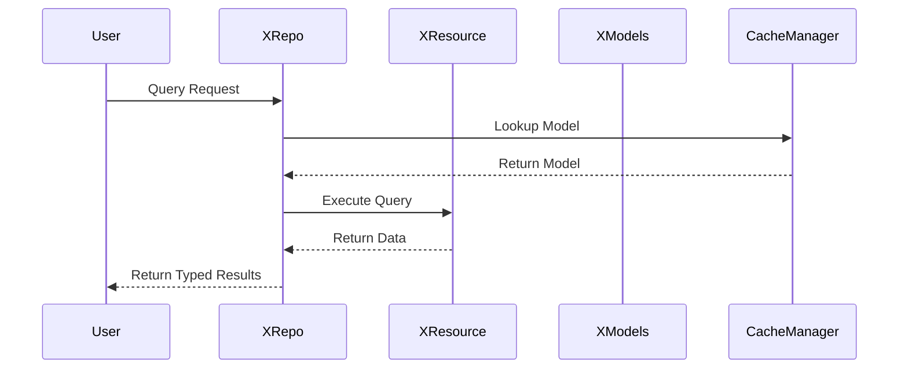

# Architecture Overview

## Component Separation of Concerns

This document illustrates the clear separation of concerns between the major components in the claudify FEATURES architecture.

## High-Level Architecture Diagram


## Component Responsibilities

### 1. **XSettings** (Configuration Management)
- **Purpose**: Centralized configuration with environment support
- **Responsibilities**:
  - Load settings from multiple sources (env, files, secrets)
  - Environment-aware configuration
  - Validation of configuration values
  - Integration with DynaConf
- **Does NOT**: Handle schema discovery or model generation

### 2. **XObjPrototype** (Base Model)
- **Purpose**: Abstract base class for all data models
- **Responsibilities**:
  - Pydantic-based validation
  - Metadata management (flat dictionary)
  - Namespace path generation
  - Fuzzy search field marking
- **Does NOT**: Handle connections, persistence, or schema discovery

### 3. **XResource** (Connection Management)
- **Purpose**: Unified abstraction for data connections
- **Responsibilities**:
  - Connection lifecycle management
  - Internal connection pooling
  - Resource-specific optimizations
  - Connection validation
- **Does NOT**: Discover schemas or generate models

### 4. **XInspector** (Schema Analysis)
- **Purpose**: Intelligent schema discovery and model generation
- **Responsibilities**:
  - Schema discovery from any data source
  - Data profiling and statistics
  - Dynamic model generation
  - Preview and sampling capabilities
- **Does NOT**: Register models or handle runtime operations

### 5. **XModels** (Model Registry)
- **Purpose**: Runtime model management and metadata
- **Responsibilities**:
  - Model registration (not generation)
  - UI widget type detection
  - Permission management
  - Audit trail configuration
- **Does NOT**: Generate models or discover schemas

### 6. **XRepo** (Data Access)
- **Purpose**: High-level data operations
- **Responsibilities**:
  - CRUD operations
  - Query building and execution
  - Transaction management
  - Multi-source data operations
- **Does NOT**: Discover schemas or generate models

### 7. **CacheManager** (Namespace System)
- **Purpose**: Object registration and resolution
- **Responsibilities**:
  - Namespace registration and lookup
  - Indirect key mapping
  - Fuzzy search capabilities
  - Cache backend management
- **Does NOT**: Generate content, only stores references

## Data Flow Examples

### Model Creation Flow


### Data Access Flow


## Key Design Principles

1. **Single Responsibility**: Each component has one clear purpose
2. **Clear Boundaries**: No overlapping functionality between components
3. **Delegation Pattern**: Components delegate to specialists (e.g., Inspector for schema discovery)
4. **Dependency Direction**: Lower layers don't depend on higher layers
5. **Interface Segregation**: Components expose only necessary methods

## Startup Sequence

```python
# 1. Settings (Configuration)
settings = XSettings()
cache.register_ns("ns.settings.app", settings)

# 2. Resources (Connections)
db_resource = DatabaseResource(settings.database)
cache.register_ns("ns.resources.db", db_resource)

# 3. Inspector (Analysis)
inspector = XInspector(db_resource)
cache.register_ns("ns.inspector.db", inspector)

# 4. Generate Models (via Inspector)
UserModel = await inspector.generate_model("users")

# 5. Register Models (via XModels)
model_registry.register(UserModel)
cache.register_ns("ns.models.User", UserModel)

# 6. Create Repos (Data Access)
user_repo = await XRepoFactory.create_from_resource(
    resource=db_resource,
    model_class=UserModel,
    schema=schema  # From Inspector
)
cache.register_ns("ns.repos.users", user_repo)
```

## Integration Points

### XInspector → XModels
- Inspector generates model classes
- Models registry stores them
- Clear handoff point

### XResource → XInspector
- Resource provides connection
- Inspector uses it for analysis
- Resource knows nothing about schemas

### XRepo → XResource
- Repo uses Resource for data operations
- Resource handles connection details
- Clean separation of concerns

### CacheManager Extension
- Extended from XRepo's cache functionality
- Provides namespace registration
- No separate NameService needed

## Benefits of This Architecture

1. **Maintainability**: Each component can be modified independently
2. **Testability**: Clear boundaries make unit testing easier
3. **Flexibility**: Components can be swapped or extended
4. **Clarity**: Purpose of each component is immediately clear
5. **Reusability**: Components can be used in different contexts