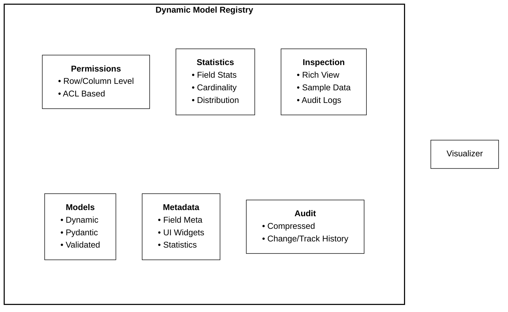
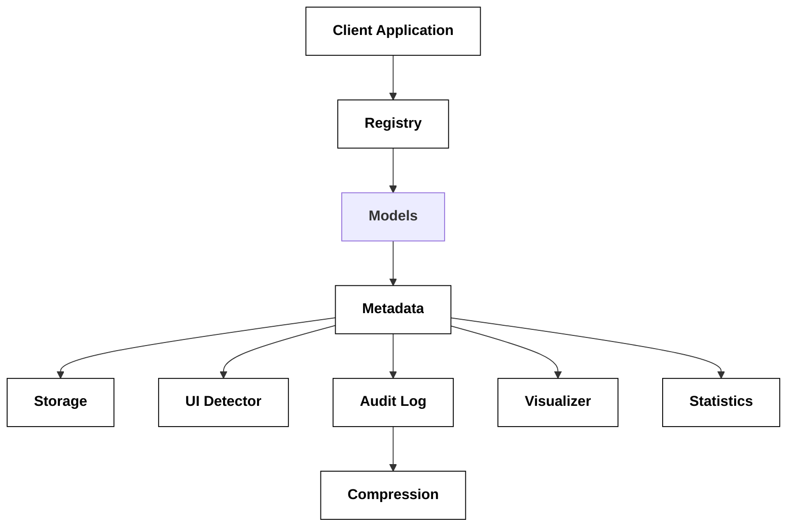

# Dynamic Model Registry - Technical Specification

## Table of Contents

1. [Executive Summary](#executive-summary)
2. [System Architecture](#system-architecture)
3. [Core Components](#core-components)
4. [Implementation Details](#implementation-details)
5. [API Reference](#api-reference)
6. [Usage Examples](#usage-examples)
7. [Configuration Guide](#configuration-guide)
8. [Best Practices](#best-practices)
9. [Performance Optimization](#performance-optimization)
10. [Security Considerations](#security-considerations)
11. [Troubleshooting](#troubleshooting)
12. [Roadmap](#roadmap)

## Executive Summary

Strict adherence to ~/dev/claudify python standards pls

The Dynamic Model Registry is a comprehensive Python framework built on Pydantic that provides runtime model creation with automatic UI generation, fine-grained permissions, compressed audit logging, and statistical analysis. It supports both CRUD and CQRS patterns, making it suitable for a wide range of applications from simple data management to complex event-sourced systems.

### Key Features

- **Dynamic Model Creation**: Create and modify data models at runtime
- **Dual Operation Modes**: Support for CRUD, CQRS, or hybrid patterns
- **Automatic UI Generation**: Smart widget detection based on field properties
- **Fine-grained Permissions**: Row-level and column-level access control
- **Compressed Audit Logging**: Complete change history with efficient storage
- **Statistical Analysis**: Automatic data profiling and cardinality detection
- **Rich Visualizations**: Beautiful terminal output using the Rich library

### Technology Stack

- **Python 3.12+**: Modern Python with latest typing features
- **Pydantic v2**: Data validation and serialization
- **Rich**: Terminal formatting and visualization
- **zlib**: Compression for audit logs
- **Type Hints**: Full type safety throughout

## System Architecture

### High-Level Overview



### Component Interaction Flow



## Core Components

### 1. Model Registry

The central component that manages all models, their metadata, and operations.

```python
class DynamicModelRegistry:
    """Main registry for dynamic models"""

    models: Dict[str, Type[BaseModel]]        # Model classes
    metadata: Dict[str, ModelMetadata]        # Model metadata
    storage: Dict[str, List[Dict[str, Any]]] # Data storage
    audit_logger: CompressedAuditLogger       # Audit system
    visualizer: DataVisualizer                # Display engine
    stats_collector: StatisticsCollector      # Analytics
```

### 2. Field Behaviors

Behavioral flags that control how fields are processed:

| Behavior   | Description                   | Use Case                    |
| ---------- | ----------------------------- | --------------------------- |
| READ_ONLY  | Field only visible in queries | Computed fields, IDs        |
| WRITE_ONLY | Field only accepts writes     | Passwords, secrets          |
| READ_WRITE | Normal field behavior         | Most fields                 |
| COMPUTED   | Calculated automatically      | Totals, derived values      |
| INDEXED    | Create index for fast lookup  | Foreign keys, search fields |
| SEARCHABLE | Include in text search        | Names, descriptions         |
| AUDITED    | Track all changes             | Sensitive data              |
| ENCRYPTED  | Store encrypted               | PII, credentials            |
| MASKED     | Mask based on permissions     | Salary, SSN                 |

### 3. UI Widget Types

Automatically detected widget types for form generation:

| Widget Type  | Detection Criteria                | Example Fields        |
| ------------ | --------------------------------- | --------------------- |
| TEXT_INPUT   | Default for strings               | name, title           |
| TEXT_AREA    | "description", "notes" in name    | description, comments |
| PASSWORD     | "password" in name                | password, secret      |
| EMAIL        | "email" in name                   | email, contact_email  |
| URL          | "url" or "link" in name           | website, product_url  |
| PHONE        | "phone" or "mobile" in name       | phone_number          |
| NUMBER_INPUT | int/float types                   | quantity, age         |
| SLIDER       | Numeric with min/max constraints  | rating (1-5)          |
| CURRENCY     | "price", "cost", "amount" in name | price, total_cost     |
| PERCENTAGE   | "percentage", "percent" in name   | discount_percentage   |
| DATE_PICKER  | datetime type                     | birth_date            |
| SELECT       | Low cardinality strings           | category, status      |
| MULTI_SELECT | List types                        | tags, categories      |
| TOGGLE       | bool type                         | is_active, enabled    |
| COLOR_PICKER | "color" in name                   | background_color      |
| JSON_EDITOR  | "json" in name or dict type       | metadata, config      |

### 4. Permission System

#### Row-Level Permissions

Control access to entire records:

```python
class RowPermissionStrategy(Enum):
    OWNER = "owner"    # Only record owner
    ROLE = "role"      # Specific roles
    CUSTOM = "custom"  # Custom function
    PUBLIC = "public"  # Anyone
```

#### Column-Level Permissions

Control access to specific fields:

```python
class ColumnPermission(BaseModel):
    field_name: str
    permissions: Set[Permission]
    roles: Set[str]
    condition: Callable[[Dict, str], bool] | None
    mask_function: Callable[[Any], Any] | None
```

### 5. Audit System

#### Compression Strategy

- Uses zlib compression for audit log entries
- Typically achieves 60-80% compression ratio
- Automatic compression/decompression
- Base64 encoding for storage

#### Change Tracking

- Automatic detection of changed fields
- Before/after value storage
- User and timestamp tracking
- Operation type logging

### 6. Statistics Engine

#### Field Analysis

- **Type Detection**: Automatic type inference
- **Cardinality**: Low/Medium/High classification
- **Distribution**: Min/max, averages, common values
- **Null Analysis**: Nullable field detection
- **Size Metrics**: Average field and row sizes

#### Cardinality Classification

| Cardinality | Unique Ratio | Use Case           |
| ----------- | ------------ | ------------------ |
| Low         | < 5%         | Categories, status |
| Medium      | 5-50%        | Names, titles      |
| High        | > 50%        | IDs, timestamps    |

## Implementation Details

### Model Registration Flow

```python
# 1. Define Pydantic model
class Product(BaseModel):
    name: str
    price: float = Field(gt=0)
    category: str
    tags: List[str] = []

# 2. Create registry
registry = DynamicModelRegistry()

# 3. Register model
registry.register_model("Product", Product)

# 4. Auto-detection happens:
# - UI widgets detected from field names/types
# - Metadata created
# - Storage initialized
# - Handlers registered
```

### CRUD Operations

```python
# Create
product = registry.create("Product", {
    "name": "Laptop",
    "price": 999.99,
    "category": "Electronics"
}, user_id="admin")

# Read (with permissions)
product = registry.read("Product", product_id, user_id="user123")

# Update (with audit)
registry.update("Product", product_id, {
    "price": 899.99
}, user_id="admin")

# Delete (soft or hard)
registry.delete("Product", product_id, soft=True, user_id="admin")

# List with filters
products = registry.list("Product", filters={
    "category": "Electronics",
    "price__gte": 500
}, page=1, page_size=20)

# Search
results = registry.search("Product", query="laptop", limit=10)
```

### Data Visualization

```python
# Model statistics
registry.show_statistics("Product")
# Output: Field types, cardinality, distributions

# Sample data view
registry.show_sample_data("Product", fields=["name", "price", "category"])
# Output: Side-by-side comparison table

# Audit trail
registry.show_audit_log(limit=20)
# Output: Chronological change history

# UI schema
registry.show_ui_schema("Product")
# Output: Widget configurations
```

## API Reference

### Registry Methods

#### `register_model`

```python
def register_model(
    name: str,
    model_class: Type[BaseModel],
    operation_mode: OperationMode = OperationMode.HYBRID
) -> None:
    """Register a new model with the registry.

    Parameters:
        name: Unique model identifier
        model_class: Pydantic model class
        operation_mode: CRUD, CQRS, or HYBRID

    Returns:
        None
    """
```

#### `create`

```python
def create(
    model_name: str,
    data: Dict[str, Any],
    user_id: str | None = None
) -> Dict[str, Any]:
    """Create a new instance of a model.

    Parameters:
        model_name: Registered model name
        data: Field values
        user_id: User performing the operation

    Returns:
        Created instance as dictionary
    """
```

#### `show_statistics`

```python
def show_statistics(model_name: str) -> None:
    """Display comprehensive statistics for a model.

    Parameters:
        model_name: Registered model name

    Output:
        Rich formatted table with field statistics
    """
```

### Field Creation Helpers

#### `create_field`

```python
def create_field(
    field_type: Type,
    default: Any = ...,
    behaviors: Set[FieldBehavior] | None = None,
    **kwargs
) -> Tuple[Type, Field, FieldMetadata]:
    """Create a field with metadata.

    Parameters:
        field_type: Python type
        default: Default value or factory
        behaviors: Set of field behaviors
        **kwargs: Additional Pydantic field parameters

    Returns:
        Tuple of (type, Field, FieldMetadata)
    """
```

### Visualization Methods

#### `show_sample_data`

```python
def show_sample_data(
    model_name: str,
    fields: List[str] | None = None,
    max_rows: int = 5
) -> None:
    """Display sample data in column format.

    Parameters:
        model_name: Registered model name
        fields: Specific fields to display (None for all)
        max_rows: Maximum number of samples

    Output:
        Rich table with fields as rows, samples as columns
    """
```

## Usage Examples

### Example 1: E-commerce Product Catalog

```python
from datetime import datetime
from typing import List
from pydantic import BaseModel, Field

class Product(BaseModel):
    sku: str = Field(description="Stock Keeping Unit")
    name: str = Field(min_length=1, max_length=200)
    description: str = ""
    price: float = Field(gt=0, description="Price in USD")
    cost: float = Field(gt=0, description="Internal cost")
    category: str
    subcategory: str | None = None
    tags: List[str] = []
    inventory_count: int = Field(ge=0)
    is_active: bool = True
    created_at: datetime = Field(default_factory=datetime.now)
    updated_at: datetime = Field(default_factory=datetime.now)

# Register with registry
registry = DynamicModelRegistry()
registry.register_model("Product", Product)

# Create products
for i in range(100):
    registry.create("Product", {
        "sku": f"PROD-{i:04d}",
        "name": f"Product {i}",
        "description": f"Description for product {i}",
        "price": 49.99 + (i * 10),
        "cost": 25.00 + (i * 5),
        "category": ["Electronics", "Clothing", "Home"][i % 3],
        "tags": ["new"] if i < 10 else ["sale"] if i > 90 else [],
        "inventory_count": 100 - i
    })

# Analyze the data
registry.show_statistics("Product")
registry.show_sample_data("Product", fields=["name", "price", "category", "inventory_count"])
```

### Example 2: User Management System

```python
class User(BaseModel):
    id: str = Field(default_factory=generate_id)
    username: str = Field(min_length=3, max_length=20)
    email: str
    password_hash: str  # Will be detected as password field
    full_name: str
    phone_number: str | None = None
    role: str = "user"  # Will become a select dropdown
    department: str | None = None
    is_active: bool = True
    last_login: datetime | None = None
    created_at: datetime = Field(default_factory=datetime.now)

# Register with row-level permissions
registry.register_model("User", User)

# Add metadata for sensitive fields
registry.metadata["User"].field_metadata["password_hash"] = FieldMetadata(
    behaviors={FieldBehavior.WRITE_ONLY}
)

registry.metadata["User"].field_metadata["email"] = FieldMetadata(
    behaviors={FieldBehavior.SEARCHABLE, FieldBehavior.INDEXED}
)
```

### Example 3: Event-Sourced Order System

```python
class Order(BaseModel):
    order_id: str = Field(default_factory=generate_id)
    customer_id: str
    items: List[Dict[str, Any]]
    subtotal: float = Field(ge=0)
    tax: float = Field(ge=0)
    total: float = Field(ge=0)
    status: str = "pending"
    payment_method: str | None = None
    shipping_address: Dict[str, str]
    created_at: datetime = Field(default_factory=datetime.now)

# Register with CQRS mode
registry.register_model("Order", Order, operation_mode=OperationMode.CQRS)

# Commands will create events
registry.execute_command(CreateOrderCommand(
    customer_id="CUST-123",
    items=[{"sku": "PROD-001", "quantity": 2, "price": 49.99}]
))

# Queries read from projections
orders = registry.execute_query(GetCustomerOrdersQuery(
    customer_id="CUST-123"
))
```

## Configuration Guide

### Environment Variables

```bash
# Compression settings
AUDIT_COMPRESSION_ENABLED=true
AUDIT_COMPRESSION_LEVEL=6  # 1-9, higher = better compression

# Storage settings
MAX_AUDIT_ENTRIES=100000
MAX_SAMPLE_ROWS=10

# Performance settings
STATISTICS_UPDATE_INTERVAL=100  # Update stats every N operations
ENABLE_FIELD_INDEXING=true

# Security settings
ENABLE_FIELD_ENCRYPTION=false
MASK_SENSITIVE_FIELDS=true
```

### Runtime Configuration

```python
# Configure registry
registry = DynamicModelRegistry()
registry.config.update({
    "audit": {
        "compression_enabled": True,
        "max_entries": 100000,
        "rotation_policy": "daily"
    },
    "statistics": {
        "sample_size": 10,
        "update_interval": 100
    },
    "visualization": {
        "max_column_width": 50,
        "date_format": "%Y-%m-%d %H:%M",
        "number_precision": 2
    }
})
```

## Best Practices

### 1. Model Design

```python
# DO: Use descriptive field names
class Good(BaseModel):
    customer_email: str  # Will auto-detect email widget
    total_amount: float  # Will auto-detect currency widget

# DON'T: Use generic names
class Bad(BaseModel):
    field1: str  # No auto-detection possible
    value: float  # Generic number input
```

### 2. Field Constraints

```python
# DO: Provide constraints for better widgets
price: float = Field(ge=0, le=1000)  # Can use slider
rating: int = Field(ge=1, le=5)  # Perfect for slider

# DON'T: Leave numeric fields unconstrained
price: float  # Just a number input
```

### 3. Categorical Fields

```python
# DO: Use string fields for categories
status: str = "active"  # Will detect as categorical
category: str  # Will analyze cardinality

# DON'T: Use arbitrary integers
status: int = 1  # No semantic meaning
```

### 4. Performance Optimization

```python
# DO: Index searchable fields
registry.metadata["Product"].field_metadata["name"] = FieldMetadata(
    behaviors={FieldBehavior.INDEXED, FieldBehavior.SEARCHABLE}
)

# DO: Limit sample data collection
registry.stats_collector.analyze(model_name, data, sample_size=10)

# DON'T: Index every field
# DON'T: Collect too many samples
```

### 5. Security Considerations

```python
# DO: Mark sensitive fields appropriately
password: str = Field(description="User password")  # Auto-detected
ssn: str = Field(description="Social Security Number")

# DO: Use field behaviors for access control
internal_notes: str = create_field(
    str,
    behaviors={FieldBehavior.WRITE_ONLY}
)

# DO: Implement row-level security
def can_access_order(order: Dict, user_id: str, roles: Set[str]) -> bool:
    return (
        order["customer_id"] == user_id or
        "admin" in roles or
        "support" in roles
    )
```

## Performance Optimization

### 1. Compression Strategies

| Data Size | Compression Ratio | Speed Impact |
| --------- | ----------------- | ------------ |
| < 1KB     | 40-60%            | Negligible   |
| 1-10KB    | 60-80%            | < 1ms        |
| 10-100KB  | 70-85%            | 1-5ms        |
| > 100KB   | 80-90%            | 5-20ms       |

### 2. Indexing Guidelines

- Index fields used in filters
- Index foreign key fields
- Limit to 3-5 indexes per model
- Compound indexes for common query patterns

### 3. Statistics Collection

```python
# Efficient statistics updates
if len(operations) % 100 == 0:  # Update every 100 operations
    registry.update_statistics(model_name)

# Incremental updates for large datasets
stats.update_incremental(new_records)
```

### 4. Memory Management

```python
# Limit in-memory storage
MAX_RECORDS_IN_MEMORY = 10000

# Use pagination for large datasets
results = registry.list("Product", page=1, page_size=100)

# Clear old audit entries
registry.audit_logger.rotate(keep_days=90)
```

## Security Considerations

### 1. Input Validation

All input is validated through Pydantic models:

- Type checking
- Constraint validation
- Custom validators
- Automatic sanitization

### 2. Access Control

Multi-level access control:

- Model-level permissions
- Row-level permissions
- Column-level permissions
- Operation-specific permissions

### 3. Audit Trail

Complete audit trail for compliance:

- Who made changes
- What was changed
- When changes occurred
- Before/after values
- Compressed storage

### 4. Data Protection

```python
# Encrypt sensitive fields
class User(BaseModel):
    ssn: str = Field(description="Encrypted SSN")

    @field_validator('ssn')
    def encrypt_ssn(cls, v):
        return encrypt(v)  # Your encryption logic

# Mask fields based on role
registry.metadata["User"].field_metadata["ssn"] = FieldMetadata(
    mask_for_roles={
        "support": lambda v: f"***-**-{v[-4:]}",
        "user": lambda v: "***-**-****"
    }
)
```

## Troubleshooting

### Common Issues

#### 1. Widget Detection Not Working

**Problem:** Fields showing as basic text inputs instead of specialized widgets.

**Solution:**

```python
# Check field naming
email_address: str  # ✓ Contains "email"
user_email: str     # ✓ Contains "email"
contact: str        # ✗ Too generic

# Provide hints via field names or metadata
```

#### 2. High Memory Usage

**Problem:** Registry consuming too much memory.

**Solution:**

```python
# Limit sample data
registry.stats_collector.analyze(model_name, data, sample_size=5)

# Enable audit log rotation
registry.audit_logger.rotate(max_entries=10000)

# Use pagination
results = registry.list("Model", page=1, page_size=50)
```

#### 3. Slow Statistics Updates

**Problem:** Statistics calculation taking too long.

**Solution:**

```python
# Update less frequently
UPDATE_INTERVAL = 1000  # Every 1000 operations

# Use sampling for large datasets
sample = random.sample(data, min(len(data), 1000))
stats = StatisticsCollector.analyze("Model", sample)
```

### Debug Mode

Enable debug logging:

```python
import logging

logging.basicConfig(level=logging.DEBUG)
logger = logging.getLogger("dynamic_model_registry")

# Trace operations
registry.debug = True
registry.create("Model", data)  # Will log all steps
```

## Roadmap

### Version 2.0 (Q2 2024)

- Database backend support (PostgreSQL, MongoDB)
- Async operations with asyncio
- WebSocket support for real-time updates
- GraphQL schema generation

### Version 2.1 (Q3 2024)

- Advanced query DSL
- Custom widget plugins
- Export/import functionality
- Multi-tenancy support

### Version 3.0 (Q4 2024)

- Distributed registry with clustering
- Advanced RBAC with ABAC
- Machine learning-based optimizations
- Visual schema designer

### Future Considerations

- Kubernetes operator for deployment
- Integration with popular ORMs
- Plugin marketplace
- SaaS offering

## Contributing

We welcome contributions! Please see our Contributing Guide for details.

### Development Setup

## License

This project is licensed under the MIT License - see the LICENSE file for details.

## Acknowledgments

- Pydantic team for the excellent validation library
- Rich team for beautiful terminal formatting
- Python community for continued support and feedback
