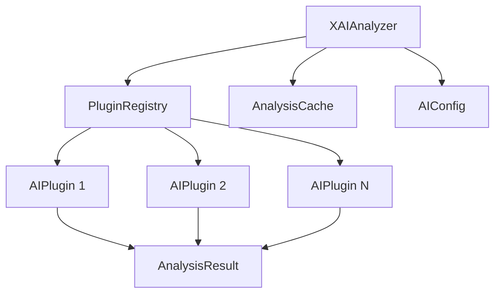

# XAI - AI-Powered Analysis Module

## Overview

XAI is a standalone AI analysis module that provides intelligent file and content analysis through a pluggable architecture. It enables smart detection, metadata inference, and content understanding using both local and cloud-based AI models.

### Core Purpose

XAI serves as an independent analysis layer that can:
- Perform intelligent file type detection beyond simple extensions
- Extract and infer rich metadata from content
- Provide semantic understanding of files and data
- Support both local models (Ollama) and cloud providers (OpenAI, Anthropic) via OpenRouter
- Integrate seamlessly with other components like XInspector

### Key Features

- **Plugin Architecture** - Extensible system for different AI capabilities
- **Smart Detection** - Content-based analysis, not just file extensions
- **Metadata Inference** - Derive context, patterns, and relationships
- **Multi-Model Support** - Use local or cloud models interchangeably
- **Content Caching** - Intelligent hash-based caching for performance
- **Flexible Interface** - Analyze both files and streams

### Design Philosophy

XAI is designed as a standalone module to ensure:
- Clean separation of concerns
- Reusability across different components
- Independent evolution and updates
- Maximum flexibility in deployment options

## Module Independence

XAI operates independently but integrates well with other components:

```python
# Standalone usage
from xai import XAIAnalyzer

analyzer = XAIAnalyzer()
results = analyzer.analyze_file("document.pdf")

# Integration with XInspector
from xinspector import XInspector
from xai import XAIAnalyzer

inspector = XInspector()
xai = XAIAnalyzer()

# Optional AI enhancement
result = await inspector.inspect("data.csv", enable_ai=True, xai_analyzer=xai)
```

## Architecture

### Core Components

XAI consists of five main components that work together to provide comprehensive AI analysis:

```python
from typing import Dict, Any, List, Optional, Union
from abc import ABC, abstractmethod
from pydantic import BaseModel
from pathlib import Path
import hashlib

class XAIAnalyzer:
    """Main orchestrator for AI analysis"""
    
    def __init__(self, config_path: Optional[str] = None):
        self.config = AIConfig(config_path)
        self.registry = PluginRegistry(self.config)
        self.cache = AnalysisCache(self.config.cache)
        
    async def analyze_file(self, file_path: Union[str, Path]) -> Dict[str, Any]:
        """Analyze a file using all applicable plugins"""
        # Check cache first
        file_hash = self._compute_hash(file_path)
        if cached := self.cache.get(file_hash):
            return cached
            
        # Run analysis
        results = {}
        for plugin_name, plugin in self.registry.get_applicable_plugins(file_path):
            if plugin.can_process(file_path):
                result = await plugin.analyze(file_path)
                results[plugin_name] = result.to_dict()
        
        # Cache results
        self.cache.set(file_hash, results)
        return results
    
    async def analyze_content(
        self, 
        content: bytes, 
        mime_type: Optional[str] = None,
        filename: Optional[str] = None
    ) -> Dict[str, Any]:
        """Analyze content from memory/stream"""
        # Similar to analyze_file but works with bytes
        pass

class AIPlugin(ABC):
    """Base class for all AI analysis plugins"""
    
    def __init__(self, config: Dict[str, Any]):
        self.config = config
        self.model = None  # Lazy loading
        
    @property
    @abstractmethod
    def name(self) -> str:
        """Plugin identifier"""
        pass
    
    @abstractmethod
    def can_process(
        self, 
        file_path: Optional[str] = None, 
        content_sample: Optional[bytes] = None,
        mime_type: Optional[str] = None
    ) -> bool:
        """Determine if plugin can handle this input"""
        pass
    
    @abstractmethod
    async def analyze(
        self, 
        file_path: Optional[str] = None,
        content: Optional[bytes] = None
    ) -> 'AnalysisResult':
        """Perform AI analysis"""
        pass
    
    def _ensure_model_loaded(self):
        """Lazy load model on first use"""
        if self.model is None:
            self.model = self._load_model()
    
    @abstractmethod
    def _load_model(self):
        """Load the AI model"""
        pass

class PluginRegistry:
    """Manages plugin discovery and lifecycle"""
    
    def __init__(self, config: AIConfig):
        self.config = config
        self.plugins: Dict[str, AIPlugin] = {}
        self._load_configured_plugins()
        
    def _load_configured_plugins(self):
        """Load plugins based on configuration"""
        for plugin_name in self.config.enabled_plugins:
            if plugin_class := self._get_plugin_class(plugin_name):
                plugin_config = self.config.plugin_settings.get(plugin_name, {})
                self.plugins[plugin_name] = plugin_class(plugin_config)
    
    def get_applicable_plugins(
        self, 
        file_path: Optional[str] = None
    ) -> List[Tuple[str, AIPlugin]]:
        """Get all plugins that can process this input"""
        return [
            (name, plugin) 
            for name, plugin in self.plugins.items()
            if plugin.can_process(file_path=file_path)
        ]

class AnalysisResult(BaseModel):
    """Standardized result format from plugins"""
    
    plugin_name: str
    data: Dict[str, Any]
    confidence: float
    confidence_scale: Dict[str, Any] = {
        "min": 0.0,
        "max": 1.0,
        "high_threshold": 0.8
    }
    processing_time_ms: float
    alternatives: Optional[List[Dict[str, Any]]] = None
    
    def to_dict(self) -> Dict[str, Any]:
        """Convert to hierarchical result structure"""
        return {
            **self.data,
            "confidence": self.confidence,
            "_confidence_scale": self.confidence_scale,
            "_processing_time_ms": self.processing_time_ms,
            "_plugin": self.plugin_name,
            **({"_alternatives": self.alternatives} if self.alternatives else {})
        }

class AIConfig:
    """Configuration management for XAI"""
    
    def __init__(self, config_path: Optional[str] = None):
        self.config_path = config_path or "xai_config.yaml"
        self._load_config()
        
    def _load_config(self):
        """Load configuration from YAML file"""
        # Implementation details for loading comprehensive config
        pass
```

### Component Interactions



### Result Structure

XAI returns hierarchical results with plugin attribution and confidence metadata:

```python
{
    "file_type": {
        "mime_type": "application/pdf",
        "confidence": 0.99,
        "_confidence_scale": {
            "min": 0.0,
            "max": 1.0,
            "high_threshold": 0.8
        },
        "_plugin": "FileTypePlugin",
        "_processing_time_ms": 45
    },
    "document_analysis": {
        "document_type": {
            "value": "invoice",
            "source": "inferred",
            "confidence": 0.85,
            "alternatives": [
                {"value": "receipt", "confidence": 0.72},
                {"value": "bill", "confidence": 0.68}
            ]
        },
        "extracted_entities": {
            "invoice_number": "INV-2024-001",
            "date": "2024-01-15",
            "total_amount": 1250.00
        },
        "_plugin": "DocumentAnalyzerPlugin",
        "_processing_time_ms": 320
    }
}
```

## Plugin System

### Plugin Categories

XAI supports a comprehensive set of plugin categories for different AI analysis tasks:

1. **File Type Detection** - Intelligent content-based file identification
2. **Image Analysis** - Object detection, scene classification, face recognition
3. **Document Analysis** - Document type classification, entity extraction
4. **Text Analysis** - NLP, sentiment analysis, language detection
5. **OCR/Text Extraction** - Extract text from images and scanned documents
6. **Audio Analysis** - Transcription, speaker identification, sound classification
7. **Metadata Extraction** - EXIF, document properties, embedded information
8. **Code Analysis** - Programming language detection, code quality metrics

### Plugin Implementation

#### Base Plugin Structure

```python
from typing import Optional, Dict, Any, List
from pathlib import Path
import magic

class FileTypePlugin(AIPlugin):
    """Intelligent file type detection plugin"""
    
    @property
    def name(self) -> str:
        return "file_type"
    
    def can_process(
        self, 
        file_path: Optional[str] = None,
        content_sample: Optional[bytes] = None,
        mime_type: Optional[str] = None
    ) -> bool:
        """Can process any file or content"""
        return file_path is not None or content_sample is not None
    
    async def analyze(
        self,
        file_path: Optional[str] = None,
        content: Optional[bytes] = None
    ) -> AnalysisResult:
        """Detect file type using multiple signals"""
        self._ensure_model_loaded()
        
        start_time = time.time()
        
        # Get content for analysis
        if file_path:
            with open(file_path, 'rb') as f:
                content_sample = f.read(8192)  # First 8KB
            extension = Path(file_path).suffix.lower()
        else:
            content_sample = content[:8192]
            extension = None
        
        # Use magic for content-based detection
        mime_type = magic.from_buffer(content_sample, mime=True)
        file_description = magic.from_buffer(content_sample)
        
        # Build result
        result_data = {
            "mime_type": mime_type,
            "description": file_description,
            "extension": extension,
            "is_text": mime_type.startswith('text/'),
            "is_binary": not mime_type.startswith('text/')
        }
        
        # Calculate confidence based on consistency
        confidence = 0.95 if extension and self._extension_matches_mime(extension, mime_type) else 0.85
        
        return AnalysisResult(
            plugin_name=self.name,
            data=result_data,
            confidence=confidence,
            processing_time_ms=(time.time() - start_time) * 1000
        )
    
    def _load_model(self):
        """File type detection doesn't need AI model"""
        return None

class ImageAnalysisPlugin(AIPlugin):
    """Computer vision plugin for image analysis"""
    
    @property
    def name(self) -> str:
        return "image_analysis"
    
    def can_process(
        self,
        file_path: Optional[str] = None,
        content_sample: Optional[bytes] = None,
        mime_type: Optional[str] = None
    ) -> bool:
        """Check if input is an image"""
        if mime_type and mime_type.startswith('image/'):
            return True
        if file_path:
            return Path(file_path).suffix.lower() in {'.jpg', '.jpeg', '.png', '.gif', '.bmp', '.webp'}
        return False
    
    async def analyze(
        self,
        file_path: Optional[str] = None,
        content: Optional[bytes] = None
    ) -> AnalysisResult:
        """Analyze image using AI model"""
        self._ensure_model_loaded()
        
        # Use model provider (OpenRouter/Ollama)
        provider = ModelManager.get_provider(self.config.get('model_provider', 'ollama'))
        
        response = await provider.analyze(
            model=self.config.get('model', 'llava'),
            image=file_path or content,
            prompt="Analyze this image. Identify objects, describe the scene, and extract any text."
        )
        
        # Parse model response
        analysis = self._parse_model_response(response)
        
        return AnalysisResult(
            plugin_name=self.name,
            data={
                "objects": analysis.get('objects', []),
                "scene_description": analysis.get('scene'),
                "text_in_image": analysis.get('text', ''),
                "dominant_colors": analysis.get('colors', [])
            },
            confidence=analysis.get('confidence', 0.85),
            alternatives=analysis.get('alternatives', [])
        )
    
    def _load_model(self):
        """Model is loaded via provider"""
        return ModelManager.get_provider(self.config.get('model_provider'))
```

### Plugin Discovery and Loading

```python
class PluginRegistry:
    """Extended plugin registry with discovery"""
    
    # Map of plugin names to classes
    AVAILABLE_PLUGINS = {
        'file_type': FileTypePlugin,
        'image_analysis': ImageAnalysisPlugin,
        'document_analyzer': DocumentAnalyzerPlugin,
        'text_analyzer': TextAnalyzerPlugin,
        'ocr': OCRPlugin,
        'audio_transcriber': AudioTranscriberPlugin,
        'metadata_extractor': MetadataExtractorPlugin,
        'code_analyzer': CodeAnalyzerPlugin
    }
    
    def _get_plugin_class(self, plugin_name: str) -> Optional[Type[AIPlugin]]:
        """Get plugin class by name"""
        return self.AVAILABLE_PLUGINS.get(plugin_name)
    
    def discover_plugins(self) -> List[str]:
        """List all available plugins"""
        return list(self.AVAILABLE_PLUGINS.keys())
    
    def load_plugin(self, plugin_name: str, config: Dict[str, Any] = None) -> Optional[AIPlugin]:
        """Load a specific plugin with configuration"""
        if plugin_class := self._get_plugin_class(plugin_name):
            return plugin_class(config or {})
        return None
```

### Plugin Configuration

Each plugin can be configured through the main configuration file:

```yaml
# xai_config.yaml
plugins:
  enabled:
    - file_type
    - image_analysis
    - document_analyzer
    - text_analyzer
    - ocr
    - metadata_extractor
    
  # Plugin-specific settings
  image_analysis:
    model_provider: ollama
    model: llava
    max_image_size_mb: 10
    confidence_threshold: 0.7
    
  document_analyzer:
    model_provider: openrouter
    model: anthropic/claude-3-haiku
    extract_entities: true
    extract_tables: true
    
  ocr:
    languages: ["en", "es", "fr"]
    enhance_image: true
    
  text_analyzer:
    model_provider: ollama
    model: llama2
    detect_language: true
    extract_keywords: true
    sentiment_analysis: true
```

### Creating Custom Plugins

To create a custom plugin, extend the `AIPlugin` base class:

```python
class CustomAnalyzerPlugin(AIPlugin):
    """Example custom plugin"""
    
    @property
    def name(self) -> str:
        return "custom_analyzer"
    
    def can_process(self, file_path: Optional[str] = None, **kwargs) -> bool:
        # Define your processing criteria
        return file_path and file_path.endswith('.custom')
    
    async def analyze(self, file_path: Optional[str] = None, **kwargs) -> AnalysisResult:
        # Implement your analysis logic
        result = await self._perform_analysis(file_path)
        
        return AnalysisResult(
            plugin_name=self.name,
            data=result,
            confidence=0.9
        )
    
    def _load_model(self):
        # Load your model if needed
        pass
```

## Model Management

### Model Provider Architecture

XAI uses a unified model provider system that supports both local and cloud-based models through a single interface:

```python
from abc import ABC, abstractmethod
from typing import Dict, Any, Optional, List
import aiohttp
import os

class ModelProvider(ABC):
    """Base class for all model providers"""
    
    @abstractmethod
    async def analyze(
        self,
        model: str,
        prompt: str,
        image: Optional[Union[str, bytes]] = None,
        **kwargs
    ) -> Dict[str, Any]:
        """Send analysis request to model"""
        pass
    
    @abstractmethod
    async def list_models(self) -> List[str]:
        """List available models"""
        pass
    
    @abstractmethod
    async def health_check(self) -> bool:
        """Check if provider is available"""
        pass

class OpenRouterProvider(ModelProvider):
    """Universal provider supporting both local and cloud models"""
    
    def __init__(self, config: Dict[str, Any]):
        self.api_key = config.get('api_key') or os.getenv('OPENROUTER_API_KEY')
        self.base_url = config.get('base_url', 'https://openrouter.ai/api/v1')
        self.prefer_local = config.get('prefer_local', False)
        self.cost_tracking = config.get('cost_tracking', {})
        self.session = None
        
    async def analyze(
        self,
        model: str,
        prompt: str,
        image: Optional[Union[str, bytes]] = None,
        **kwargs
    ) -> Dict[str, Any]:
        """Analyze using OpenRouter's unified API"""
        if not self.session:
            self.session = aiohttp.ClientSession()
            
        headers = {
            "Authorization": f"Bearer {self.api_key}",
            "HTTP-Referer": kwargs.get('referer', 'https://github.com/xai'),
            "X-Title": "XAI Analysis"
        }
        
        # Build message
        messages = [{
            "role": "user",
            "content": prompt
        }]
        
        # Add image if provided
        if image:
            if isinstance(image, str) and os.path.exists(image):
                # File path - convert to base64
                import base64
                with open(image, 'rb') as f:
                    image_data = base64.b64encode(f.read()).decode()
                image_url = f"data:image/jpeg;base64,{image_data}"
            else:
                # Already base64 or URL
                image_url = image
                
            messages[0]["content"] = [
                {"type": "text", "text": prompt},
                {"type": "image_url", "image_url": {"url": image_url}}
            ]
        
        payload = {
            "model": model,
            "messages": messages,
            "temperature": kwargs.get('temperature', 0.7),
            "max_tokens": kwargs.get('max_tokens', 2048)
        }
        
        # Track costs if enabled
        if self.cost_tracking.get('enabled'):
            self._track_cost_estimate(model, payload)
        
        async with self.session.post(
            f"{self.base_url}/chat/completions",
            headers=headers,
            json=payload
        ) as response:
            result = await response.json()
            
            # Track actual costs
            if self.cost_tracking.get('enabled'):
                self._track_actual_cost(model, result)
                
            return result
    
    async def list_models(self) -> List[str]:
        """List available models from OpenRouter"""
        async with self.session.get(
            f"{self.base_url}/models",
            headers={"Authorization": f"Bearer {self.api_key}"}
        ) as response:
            data = await response.json()
            return [model['id'] for model in data.get('data', [])]
    
    def _track_cost_estimate(self, model: str, payload: Dict[str, Any]):
        """Track estimated costs before request"""
        model_costs = self.cost_tracking.get('model_costs', {})
        if model in model_costs:
            # Simple token estimation
            estimated_tokens = len(str(payload)) / 4
            estimated_cost = model_costs[model] * (estimated_tokens / 1000)
            
            # Check daily budget
            daily_budget = self.cost_tracking.get('budget_daily', float('inf'))
            if self._get_daily_spend() + estimated_cost > daily_budget:
                if self.cost_tracking.get('fallback_to_local'):
                    # Switch to local model
                    raise BudgetExceededException("Daily budget exceeded, falling back to local")

class OllamaProvider(ModelProvider):
    """Direct Ollama provider for local models"""
    
    def __init__(self, config: Dict[str, Any]):
        self.base_url = config.get('base_url', 'http://localhost:11434')
        self.session = None
        
    async def analyze(
        self,
        model: str,
        prompt: str,
        image: Optional[Union[str, bytes]] = None,
        **kwargs
    ) -> Dict[str, Any]:
        """Analyze using local Ollama"""
        if not self.session:
            self.session = aiohttp.ClientSession()
            
        endpoint = "/api/generate"
        if image:
            # Use vision endpoint
            endpoint = "/api/generate"
            # Ollama expects base64 images in prompt
            
        payload = {
            "model": model,
            "prompt": prompt,
            "stream": False
        }
        
        async with self.session.post(
            f"{self.base_url}{endpoint}",
            json=payload
        ) as response:
            return await response.json()

class ModelManager:
    """Manages model providers and routing"""
    
    _instance = None
    _providers: Dict[str, ModelProvider] = {}
    
    @classmethod
    def get_instance(cls):
        if cls._instance is None:
            cls._instance = cls()
        return cls._instance
    
    @classmethod
    def register_provider(cls, name: str, provider: ModelProvider):
        """Register a model provider"""
        cls._providers[name] = provider
    
    @classmethod
    def get_provider(cls, name: str) -> ModelProvider:
        """Get a registered provider"""
        if name not in cls._providers:
            raise ValueError(f"Provider {name} not registered")
        return cls._providers[name]
    
    @classmethod
    def initialize_from_config(cls, config: Dict[str, Any]):
        """Initialize providers from configuration"""
        for provider_name, provider_config in config.get('model_providers', {}).items():
            provider_type = provider_config.get('type')
            
            if provider_type == 'openrouter':
                provider = OpenRouterProvider(provider_config)
            elif provider_type == 'ollama':
                provider = OllamaProvider(provider_config)
            elif provider_type == 'openai':
                provider = OpenAIProvider(provider_config)
            elif provider_type == 'anthropic':
                provider = AnthropicProvider(provider_config)
            else:
                continue
                
            cls.register_provider(provider_name, provider)
```

### OpenRouter Configuration

OpenRouter provides unified access to both local and cloud models:

```yaml
# xai_config.yaml
model_providers:
  # Local models via OpenRouter
  openrouter_local:
    type: openrouter
    api_key: ${OPENROUTER_API_KEY}
    base_url: https://openrouter.ai/api/v1
    prefer_local: true
    routing_preferences:
      # Route to local Ollama when available
      local_endpoints:
        ollama: http://localhost:11434
      # Prefer local for these model patterns
      local_model_patterns:
        - "ollama/*"
        - "local/*"
    
  # Cloud models via OpenRouter  
  openrouter_cloud:
    type: openrouter
    api_key: ${OPENROUTER_API_KEY}
    base_url: https://openrouter.ai/api/v1
    cost_tracking:
      enabled: true
      budget_daily: 10.00  # $10/day limit
      budget_monthly: 200.00
      fallback_to_local: true
      alert_threshold: 0.80  # Alert at 80% of budget
    # Model-specific costs (per 1K tokens)
    model_costs:
      "openai/gpt-4-vision-preview": 0.03
      "anthropic/claude-3-opus": 0.025
      "anthropic/claude-3-haiku": 0.0025
      "google/gemini-pro-vision": 0.005
      "ollama/llava:7b": 0.0  # Free (local)
      "ollama/llama2:70b": 0.0  # Free (local)
    
  # Direct Ollama for guaranteed local
  ollama_direct:
    type: ollama
    base_url: http://localhost:11434
    models:
      - llava:7b
      - llama2:70b
      - codellama:13b
      - mixtral:8x7b
```

### Smart Model Routing

XAI can intelligently route requests based on various factors:

```python
class SmartRouter:
    """Intelligent routing between local and cloud models"""
    
    def __init__(self, config: Dict[str, Any]):
        self.config = config
        self.providers = {}
        self.usage_stats = {}
        
    async def route_request(
        self,
        task_type: str,
        complexity: str = "medium",
        content_size: int = 0,
        privacy_sensitive: bool = False
    ) -> Tuple[str, str]:
        """Determine best provider and model for request"""
        
        # Privacy-sensitive data stays local
        if privacy_sensitive:
            return ("ollama_direct", "llama2:70b")
        
        # Large files processed locally to avoid transfer costs
        if content_size > 10 * 1024 * 1024:  # 10MB
            return ("ollama_direct", self._get_local_model(task_type))
        
        # Complex tasks use best available model
        if complexity == "high":
            if self._within_budget("openrouter_cloud"):
                return ("openrouter_cloud", self._get_best_model(task_type))
            else:
                return ("openrouter_local", self._get_fallback_model(task_type))
        
        # Default to local for simple tasks
        return ("openrouter_local", self._get_local_model(task_type))
    
    def _get_best_model(self, task_type: str) -> str:
        """Get best model for task type"""
        model_map = {
            "image_analysis": "openai/gpt-4-vision-preview",
            "document_analysis": "anthropic/claude-3-opus",
            "code_analysis": "anthropic/claude-3-opus",
            "text_analysis": "openai/gpt-4-turbo",
            "general": "anthropic/claude-3-haiku"
        }
        return model_map.get(task_type, "anthropic/claude-3-haiku")
    
    def _get_local_model(self, task_type: str) -> str:
        """Get best local model for task type"""
        model_map = {
            "image_analysis": "llava:7b",
            "document_analysis": "llama2:70b",
            "code_analysis": "codellama:13b",
            "text_analysis": "llama2:70b",
            "general": "llama2:7b"
        }
        return f"ollama/{model_map.get(task_type, 'llama2:7b')}"
```

### Model Downloader

Built-in model management for local deployments:

```python
class ModelDownloader:
    """Download and manage local models"""
    
    def __init__(self, cache_dir: str = "~/.xai/models"):
        self.cache_dir = Path(cache_dir).expanduser()
        self.cache_dir.mkdir(parents=True, exist_ok=True)
        
    async def download_model(
        self,
        model_id: str,
        provider: str = "huggingface"
    ) -> Path:
        """Download model if not cached"""
        model_path = self.cache_dir / provider / model_id.replace('/', '_')
        
        if model_path.exists():
            return model_path
            
        # Download based on provider
        if provider == "huggingface":
            await self._download_from_huggingface(model_id, model_path)
        elif provider == "ollama":
            await self._pull_ollama_model(model_id)
            
        return model_path
    
    async def _pull_ollama_model(self, model_id: str):
        """Pull model using Ollama"""
        import subprocess
        subprocess.run(["ollama", "pull", model_id], check=True)
    
    def list_cached_models(self) -> Dict[str, List[str]]:
        """List all cached models by provider"""
        models = {}
        for provider_dir in self.cache_dir.iterdir():
            if provider_dir.is_dir():
                models[provider_dir.name] = [
                    model.name for model in provider_dir.iterdir()
                ]
        return models
```

## Caching System

### Hash-Based Content Caching

XAI implements an intelligent caching system to avoid redundant AI analysis:

```python
import hashlib
import json
import time
from pathlib import Path
from typing import Dict, Any, Optional, Union
import pickle
import gzip
from datetime import datetime, timedelta

class AnalysisCache:
    """Content-based caching for AI analysis results"""
    
    def __init__(self, config: Dict[str, Any]):
        self.cache_dir = Path(config.get('cache_dir', '~/.xai/cache')).expanduser()
        self.cache_dir.mkdir(parents=True, exist_ok=True)
        self.ttl_seconds = config.get('ttl_seconds', 86400)  # 24 hours default
        self.max_cache_size_mb = config.get('max_size_mb', 1000)  # 1GB default
        self.compression = config.get('compression', True)
        self.stats = CacheStats()
        
    def _compute_hash(self, content: Union[str, bytes, Path]) -> str:
        """Compute SHA-256 hash for content"""
        hasher = hashlib.sha256()
        
        if isinstance(content, Path) or isinstance(content, str) and Path(content).exists():
            # File - hash in chunks
            path = Path(content)
            with open(path, 'rb') as f:
                while chunk := f.read(8192):
                    hasher.update(chunk)
            # Include file metadata in hash
            stat = path.stat()
            hasher.update(f"{stat.st_size}:{stat.st_mtime}".encode())
        else:
            # Raw content
            if isinstance(content, str):
                content = content.encode()
            hasher.update(content)
            
        return hasher.hexdigest()
    
    def get(self, content_hash: str) -> Optional[Dict[str, Any]]:
        """Retrieve cached analysis results"""
        cache_file = self.cache_dir / f"{content_hash}.cache"
        
        if not cache_file.exists():
            self.stats.misses += 1
            return None
            
        try:
            # Check TTL
            if time.time() - cache_file.stat().st_mtime > self.ttl_seconds:
                cache_file.unlink()
                self.stats.evictions += 1
                return None
                
            # Load cached data
            if self.compression:
                with gzip.open(cache_file, 'rb') as f:
                    data = pickle.load(f)
            else:
                with open(cache_file, 'rb') as f:
                    data = pickle.load(f)
                    
            self.stats.hits += 1
            return data
            
        except Exception as e:
            # Corrupted cache entry
            cache_file.unlink()
            self.stats.errors += 1
            return None
    
    def set(self, content_hash: str, results: Dict[str, Any]):
        """Cache analysis results"""
        cache_file = self.cache_dir / f"{content_hash}.cache"
        
        try:
            # Check cache size limits
            if self._get_cache_size_mb() > self.max_cache_size_mb:
                self._evict_oldest()
                
            # Save with metadata
            cache_data = {
                'results': results,
                'timestamp': time.time(),
                'version': '1.0'
            }
            
            if self.compression:
                with gzip.open(cache_file, 'wb') as f:
                    pickle.dump(cache_data, f)
            else:
                with open(cache_file, 'wb') as f:
                    pickle.dump(cache_data, f)
                    
            self.stats.writes += 1
            
        except Exception as e:
            self.stats.errors += 1
            raise
    
    def _get_cache_size_mb(self) -> float:
        """Calculate total cache size"""
        total_size = sum(f.stat().st_size for f in self.cache_dir.glob('*.cache'))
        return total_size / (1024 * 1024)
    
    def _evict_oldest(self):
        """Remove oldest cache entries to free space"""
        cache_files = list(self.cache_dir.glob('*.cache'))
        # Sort by modification time
        cache_files.sort(key=lambda f: f.stat().st_mtime)
        
        # Remove oldest 10%
        to_remove = max(1, len(cache_files) // 10)
        for f in cache_files[:to_remove]:
            f.unlink()
            self.stats.evictions += 1
    
    def clear(self):
        """Clear all cache entries"""
        for cache_file in self.cache_dir.glob('*.cache'):
            cache_file.unlink()
        self.stats.clears += 1
    
    def get_stats(self) -> Dict[str, Any]:
        """Get cache statistics"""
        return {
            'hits': self.stats.hits,
            'misses': self.stats.misses,
            'hit_rate': self.stats.get_hit_rate(),
            'writes': self.stats.writes,
            'evictions': self.stats.evictions,
            'errors': self.stats.errors,
            'size_mb': self._get_cache_size_mb(),
            'entry_count': len(list(self.cache_dir.glob('*.cache')))
        }

class CacheStats:
    """Track cache performance metrics"""
    
    def __init__(self):
        self.hits = 0
        self.misses = 0
        self.writes = 0
        self.evictions = 0
        self.errors = 0
        self.clears = 0
        
    def get_hit_rate(self) -> float:
        """Calculate cache hit rate"""
        total = self.hits + self.misses
        return self.hits / total if total > 0 else 0.0
```

### Intelligent Cache Key Generation

Cache keys include multiple factors to ensure accuracy:

```python
class CacheKeyGenerator:
    """Generate cache keys with context awareness"""
    
    @staticmethod
    def generate_key(
        content_hash: str,
        plugin_name: str,
        plugin_version: str,
        model_name: Optional[str] = None,
        additional_context: Optional[Dict[str, Any]] = None
    ) -> str:
        """Generate composite cache key"""
        key_parts = [
            content_hash,
            plugin_name,
            plugin_version
        ]
        
        if model_name:
            key_parts.append(model_name)
            
        if additional_context:
            # Sort for consistent ordering
            context_str = json.dumps(additional_context, sort_keys=True)
            context_hash = hashlib.md5(context_str.encode()).hexdigest()[:8]
            key_parts.append(context_hash)
            
        return ":".join(key_parts)
```

### Cache-Aware Analysis

Integration with the main analyzer:

```python
class XAIAnalyzer:
    """Extended with intelligent caching"""
    
    async def analyze_file(
        self, 
        file_path: Union[str, Path],
        force_refresh: bool = False
    ) -> Dict[str, Any]:
        """Analyze with cache support"""
        file_path = Path(file_path)
        
        # Compute content hash
        content_hash = self.cache._compute_hash(file_path)
        
        # Check if we should use cache
        if not force_refresh:
            # Try to get from cache
            cached_results = {}
            
            for plugin_name, plugin in self.registry.get_applicable_plugins(str(file_path)):
                cache_key = CacheKeyGenerator.generate_key(
                    content_hash=content_hash,
                    plugin_name=plugin_name,
                    plugin_version=plugin.version,
                    model_name=plugin.get_model_name() if hasattr(plugin, 'get_model_name') else None
                )
                
                if cached := self.cache.get(cache_key):
                    cached_results[plugin_name] = cached
                    
            # If all plugins have cached results, return them
            if len(cached_results) == len(self.registry.get_applicable_plugins(str(file_path))):
                return self._merge_results(cached_results)
        
        # Run fresh analysis
        results = {}
        for plugin_name, plugin in self.registry.get_applicable_plugins(str(file_path)):
            if plugin.can_process(str(file_path)):
                # Check individual plugin cache
                cache_key = CacheKeyGenerator.generate_key(
                    content_hash=content_hash,
                    plugin_name=plugin_name,
                    plugin_version=plugin.version,
                    model_name=plugin.get_model_name() if hasattr(plugin, 'get_model_name') else None
                )
                
                if not force_refresh and (cached := self.cache.get(cache_key)):
                    results[plugin_name] = cached
                else:
                    # Run analysis
                    result = await plugin.analyze(str(file_path))
                    result_dict = result.to_dict()
                    results[plugin_name] = result_dict
                    
                    # Cache the result
                    self.cache.set(cache_key, result_dict)
        
        return self._merge_results(results)
```

### Cache Warming and Preloading

Optimize performance with cache warming:

```python
class CacheWarmer:
    """Preload cache for common analysis patterns"""
    
    def __init__(self, analyzer: XAIAnalyzer):
        self.analyzer = analyzer
        
    async def warm_directory(
        self, 
        directory: Path,
        patterns: List[str] = None,
        recursive: bool = True
    ):
        """Warm cache for all files in directory"""
        if patterns is None:
            patterns = ['*']
            
        files = []
        for pattern in patterns:
            if recursive:
                files.extend(directory.rglob(pattern))
            else:
                files.extend(directory.glob(pattern))
                
        # Analyze in parallel with rate limiting
        import asyncio
        semaphore = asyncio.Semaphore(5)  # Max 5 concurrent
        
        async def analyze_with_limit(file_path):
            async with semaphore:
                try:
                    await self.analyzer.analyze_file(file_path)
                except Exception as e:
                    print(f"Failed to warm cache for {file_path}: {e}")
                    
        tasks = [analyze_with_limit(f) for f in files if f.is_file()]
        await asyncio.gather(*tasks)
```

## Integration Patterns

### XInspector Integration

XAI seamlessly integrates with XInspector to provide AI-enhanced schema discovery:

```python
from typing import Optional, Dict, Any
from pathlib import Path

class XInspector:
    """Extended XInspector with AI capabilities"""
    
    def __init__(self, xai_analyzer: Optional['XAIAnalyzer'] = None):
        # Original XInspector initialization
        self.resource_factory = ResourceFactory()
        self.schema_cache = {}
        
        # Optional AI enhancement
        self.xai = xai_analyzer
        self.ai_enabled = xai_analyzer is not None
        
    async def inspect(
        self,
        source: Union[str, Path],
        enable_ai: bool = True,
        xai_analyzer: Optional['XAIAnalyzer'] = None
    ) -> InspectionResult:
        """Inspect with optional AI enhancement"""
        # Use provided analyzer or instance default
        ai_analyzer = xai_analyzer or self.xai
        use_ai = enable_ai and ai_analyzer is not None
        
        # Standard inspection
        result = await self._standard_inspection(source)
        
        # AI enhancement if available
        if use_ai:
            ai_results = await ai_analyzer.analyze_file(source)
            result = self._enhance_with_ai(result, ai_results)
            
        return result
    
    def _enhance_with_ai(
        self,
        inspection_result: InspectionResult,
        ai_results: Dict[str, Any]
    ) -> InspectionResult:
        """Enhance inspection results with AI insights"""
        # Extract relevant AI insights
        if 'document_analysis' in ai_results:
            doc_analysis = ai_results['document_analysis']
            
            # Add inferred document type
            if doc_type := doc_analysis.get('document_type'):
                inspection_result.metadata['ai_document_type'] = doc_type
                
            # Add extracted entities
            if entities := doc_analysis.get('extracted_entities'):
                inspection_result.metadata['ai_entities'] = entities
                
        # Add AI-detected patterns
        if 'text_analysis' in ai_results:
            text_analysis = ai_results['text_analysis']
            
            # Language detection
            if language := text_analysis.get('detected_language'):
                inspection_result.metadata['language'] = language
                
            # Key phrases
            if keywords := text_analysis.get('keywords'):
                inspection_result.metadata['keywords'] = keywords
                
        # Enhanced schema inference
        if inspection_result.schema_type == 'tabular':
            inspection_result.schema = self._ai_enhance_schema(
                inspection_result.schema,
                ai_results
            )
            
        return inspection_result
    
    def _ai_enhance_schema(
        self,
        schema: Dict[str, Any],
        ai_results: Dict[str, Any]
    ) -> Dict[str, Any]:
        """Use AI to enhance schema detection"""
        # Look for AI insights about columns
        if 'data_analysis' in ai_results:
            data_insights = ai_results['data_analysis']
            
            # Enhanced column type detection
            if column_insights := data_insights.get('columns'):
                for col_name, insights in column_insights.items():
                    if col_name in schema['columns']:
                        # AI-suggested data type
                        if suggested_type := insights.get('suggested_type'):
                            schema['columns'][col_name]['ai_type'] = suggested_type
                            
                        # Semantic meaning
                        if semantic := insights.get('semantic_meaning'):
                            schema['columns'][col_name]['semantic'] = semantic
                            
                        # Detected patterns
                        if patterns := insights.get('patterns'):
                            schema['columns'][col_name]['patterns'] = patterns
                            
        return schema
```

### Standalone Usage Patterns

Using XAI independently for various tasks:

```python
# 1. Basic file analysis
from xai import XAIAnalyzer

analyzer = XAIAnalyzer()
results = await analyzer.analyze_file("document.pdf")

# 2. Streaming content analysis
content = await fetch_from_api()
results = await analyzer.analyze_content(
    content=content,
    mime_type="application/json",
    filename="api_response.json"
)

# 3. Batch processing with caching
from pathlib import Path

async def batch_analyze(directory: Path):
    analyzer = XAIAnalyzer()
    results = {}
    
    for file_path in directory.glob("**/*"):
        if file_path.is_file():
            try:
                result = await analyzer.analyze_file(file_path)
                results[str(file_path)] = result
            except Exception as e:
                print(f"Failed to analyze {file_path}: {e}")
                
    return results

# 4. Custom plugin configuration
analyzer = XAIAnalyzer(config_path="custom_xai.yaml")

# Enable only specific plugins
analyzer.registry.disable_all()
analyzer.registry.enable_plugins(['file_type', 'text_analyzer'])

# 5. Model preference routing
from xai import ModelManager

# Configure to prefer local models
ModelManager.initialize_from_config({
    'model_providers': {
        'primary': {
            'type': 'ollama',
            'base_url': 'http://localhost:11434'
        },
        'fallback': {
            'type': 'openrouter',
            'api_key': '${OPENROUTER_API_KEY}',
            'prefer_local': True
        }
    }
})
```

### Integration with Data Pipelines

XAI as part of data processing pipelines:

```python
class DataPipeline:
    """Example data pipeline with AI analysis"""
    
    def __init__(self):
        self.xai = XAIAnalyzer()
        self.inspector = XInspector(xai_analyzer=self.xai)
        
    async def process_file(self, file_path: Path) -> Dict[str, Any]:
        """Process file through pipeline stages"""
        result = {
            'file': str(file_path),
            'stages': {}
        }
        
        # Stage 1: AI Analysis
        ai_analysis = await self.xai.analyze_file(file_path)
        result['stages']['ai_analysis'] = ai_analysis
        
        # Stage 2: Schema Inspection
        inspection = await self.inspector.inspect(file_path)
        result['stages']['inspection'] = inspection.to_dict()
        
        # Stage 3: Content Extraction based on AI insights
        if self._is_document(ai_analysis):
            content = await self._extract_document_content(
                file_path, 
                ai_analysis
            )
            result['stages']['extraction'] = content
            
        # Stage 4: Data Quality Assessment
        quality = self._assess_quality(inspection, ai_analysis)
        result['stages']['quality'] = quality
        
        return result
    
    def _is_document(self, ai_analysis: Dict[str, Any]) -> bool:
        """Check if file is a document based on AI analysis"""
        if 'file_type' in ai_analysis:
            mime_type = ai_analysis['file_type'].get('mime_type', '')
            return (
                mime_type.startswith('text/') or
                mime_type in ['application/pdf', 'application/msword']
            )
        return False
    
    async def _extract_document_content(
        self,
        file_path: Path,
        ai_analysis: Dict[str, Any]
    ) -> Dict[str, Any]:
        """Extract content based on document type"""
        extraction = {}
        
        # Use OCR if needed
        if 'ocr' in ai_analysis:
            extraction['text'] = ai_analysis['ocr'].get('extracted_text', '')
            
        # Use document analysis results
        if 'document_analysis' in ai_analysis:
            doc = ai_analysis['document_analysis']
            extraction['entities'] = doc.get('extracted_entities', {})
            extraction['document_type'] = doc.get('document_type', {})
            
        return extraction
```

### Event-Driven Integration

React to XAI analysis results:

```python
from typing import Callable, List
import asyncio

class XAIEventHandler:
    """Event-driven processing based on AI analysis"""
    
    def __init__(self, analyzer: XAIAnalyzer):
        self.analyzer = analyzer
        self.handlers: Dict[str, List[Callable]] = {}
        
    def on_detection(self, detection_type: str, handler: Callable):
        """Register handler for specific detections"""
        if detection_type not in self.handlers:
            self.handlers[detection_type] = []
        self.handlers[detection_type].append(handler)
        
    async def analyze_and_handle(self, file_path: Path):
        """Analyze file and trigger appropriate handlers"""
        results = await self.analyzer.analyze_file(file_path)
        
        # Trigger handlers based on results
        tasks = []
        
        # File type handlers
        if 'file_type' in results:
            mime_type = results['file_type'].get('mime_type', '')
            if mime_type in self.handlers:
                for handler in self.handlers[mime_type]:
                    tasks.append(handler(file_path, results))
                    
        # Document type handlers
        if 'document_analysis' in results:
            doc_type = results['document_analysis'].get('document_type', {})
            if doc_type.get('value') in self.handlers:
                for handler in self.handlers[doc_type['value']]:
                    tasks.append(handler(file_path, results))
                    
        # Pattern-based handlers
        for key, handlers in self.handlers.items():
            if key.startswith('pattern:'):
                pattern = key[8:]  # Remove 'pattern:' prefix
                if self._matches_pattern(results, pattern):
                    for handler in handlers:
                        tasks.append(handler(file_path, results))
                        
        # Execute all handlers
        if tasks:
            await asyncio.gather(*tasks)
            
    def _matches_pattern(self, results: Dict[str, Any], pattern: str) -> bool:
        """Check if results match a pattern"""
        # Implementation of pattern matching logic
        # Could check for specific keywords, entities, etc.
        pass

# Usage example
handler = XAIEventHandler(analyzer)

# Register handlers
handler.on_detection('application/pdf', process_pdf)
handler.on_detection('invoice', process_invoice)
handler.on_detection('pattern:sensitive_data', handle_sensitive)

# Process files
await handler.analyze_and_handle(Path("document.pdf"))
```

### API Integration

Expose XAI through REST API:

```python
from fastapi import FastAPI, UploadFile, File, HTTPException
from fastapi.responses import JSONResponse
import tempfile

app = FastAPI()
xai_analyzer = XAIAnalyzer()

@app.post("/analyze/file")
async def analyze_file(file: UploadFile = File(...)):
    """Analyze uploaded file"""
    try:
        # Save uploaded file temporarily
        with tempfile.NamedTemporaryFile(delete=False) as tmp:
            content = await file.read()
            tmp.write(content)
            tmp_path = tmp.name
            
        # Analyze
        results = await xai_analyzer.analyze_file(tmp_path)
        
        # Clean up
        Path(tmp_path).unlink()
        
        return JSONResponse(content=results)
        
    except Exception as e:
        raise HTTPException(status_code=500, detail=str(e))

@app.post("/analyze/content")
async def analyze_content(
    content: bytes,
    mime_type: Optional[str] = None,
    filename: Optional[str] = None
):
    """Analyze raw content"""
    try:
        results = await xai_analyzer.analyze_content(
            content=content,
            mime_type=mime_type,
            filename=filename
        )
        return JSONResponse(content=results)
        
    except Exception as e:
        raise HTTPException(status_code=500, detail=str(e))

@app.get("/cache/stats")
async def get_cache_stats():
    """Get cache statistics"""
    return xai_analyzer.cache.get_stats()

@app.post("/cache/clear")
async def clear_cache():
    """Clear analysis cache"""
    xai_analyzer.cache.clear()
    return {"status": "cache cleared"}
```

## Usage Examples

### Basic Usage Examples

Common XAI usage patterns for everyday tasks:

```python
import asyncio
from pathlib import Path
from xai import XAIAnalyzer

# Initialize analyzer
analyzer = XAIAnalyzer()

# Example 1: Simple file analysis
async def analyze_single_file():
    """Analyze a single file"""
    results = await analyzer.analyze_file("invoice.pdf")
    
    # Access specific plugin results
    if 'document_analysis' in results:
        doc_type = results['document_analysis']['document_type']['value']
        print(f"Document type: {doc_type}")
        
        # Extract entities
        entities = results['document_analysis'].get('extracted_entities', {})
        for entity_type, value in entities.items():
            print(f"{entity_type}: {value}")

# Example 2: Batch analysis with filtering
async def analyze_directory():
    """Analyze all PDFs in a directory"""
    pdf_dir = Path("documents/invoices")
    
    for pdf_file in pdf_dir.glob("*.pdf"):
        try:
            results = await analyzer.analyze_file(pdf_file)
            
            # Check if it's an invoice
            doc_analysis = results.get('document_analysis', {})
            if doc_analysis.get('document_type', {}).get('value') == 'invoice':
                print(f"Found invoice: {pdf_file.name}")
                # Process invoice data
                
        except Exception as e:
            print(f"Error analyzing {pdf_file}: {e}")

# Example 3: Content-based analysis
async def analyze_api_response():
    """Analyze content from API"""
    # Simulate API response
    api_data = b'{"user": "john", "amount": 1000, "currency": "USD"}'
    
    results = await analyzer.analyze_content(
        content=api_data,
        mime_type="application/json",
        filename="transaction.json"
    )
    
    # Check for sensitive data patterns
    if 'text_analysis' in results:
        if results['text_analysis'].get('contains_pii', False):
            print("Warning: Content contains PII")

# Example 4: Selective plugin usage
async def fast_file_detection():
    """Quick file type detection only"""
    # Create analyzer with limited plugins
    fast_analyzer = XAIAnalyzer()
    fast_analyzer.registry.disable_all()
    fast_analyzer.registry.enable_plugins(['file_type', 'metadata_extractor'])
    
    results = await fast_analyzer.analyze_file("document.docx")
    print(f"MIME type: {results['file_type']['mime_type']}")
    print(f"File size: {results['metadata_extractor']['file_size']}")

# Example 5: Force refresh bypassing cache
async def fresh_analysis():
    """Force new analysis ignoring cache"""
    # Initial analysis (cached)
    results1 = await analyzer.analyze_file("report.pdf")
    
    # Force fresh analysis
    results2 = await analyzer.analyze_file("report.pdf", force_refresh=True)
    
    # Compare processing times
    time1 = results1['document_analysis']['_processing_time_ms']
    time2 = results2['document_analysis']['_processing_time_ms']
    print(f"Cached: {time1}ms, Fresh: {time2}ms")
```

### Advanced Scenarios

Complex use cases demonstrating XAI's full capabilities:

```python
# Example 1: Custom plugin with confidence thresholds
async def confidence_based_routing():
    """Route based on analysis confidence"""
    results = await analyzer.analyze_file("contract.pdf")
    
    # Check document type confidence
    doc_analysis = results.get('document_analysis', {})
    doc_type = doc_analysis.get('document_type', {})
    
    if doc_type.get('confidence', 0) >= 0.9:
        # High confidence - automatic processing
        await process_document_automatically(results)
    elif doc_type.get('confidence', 0) >= 0.7:
        # Medium confidence - human review
        await queue_for_review(results, priority='normal')
    else:
        # Low confidence - manual classification
        await queue_for_review(results, priority='high')
        
        # Check alternatives
        alternatives = doc_type.get('alternatives', [])
        print("Possible document types:")
        for alt in alternatives:
            print(f"- {alt['value']}: {alt['confidence']:.2f}")

# Example 2: Multi-model consensus
async def multi_model_analysis():
    """Use multiple models for consensus"""
    file_path = "medical_report.pdf"
    
    # Configure different model providers
    models = [
        ('ollama', 'llama2:70b'),
        ('openrouter', 'anthropic/claude-3-haiku'),
        ('openrouter', 'openai/gpt-4-vision-preview')
    ]
    
    all_results = []
    
    for provider, model in models:
        # Create analyzer with specific model
        model_analyzer = XAIAnalyzer()
        model_analyzer.registry.plugins['document_analyzer'].config.update({
            'model_provider': provider,
            'model': model
        })
        
        results = await model_analyzer.analyze_file(file_path)
        all_results.append((model, results))
    
    # Aggregate results
    consensus = aggregate_model_results(all_results)
    return consensus

# Example 3: Streaming analysis for large files
async def stream_large_file():
    """Process large files in chunks"""
    large_file = Path("video_transcript.txt")
    chunk_size = 1024 * 1024  # 1MB chunks
    
    analyzer = XAIAnalyzer()
    aggregated_results = {}
    
    with open(large_file, 'rb') as f:
        chunk_num = 0
        while chunk := f.read(chunk_size):
            # Analyze chunk
            results = await analyzer.analyze_content(
                content=chunk,
                mime_type="text/plain",
                filename=f"chunk_{chunk_num}.txt"
            )
            
            # Aggregate results
            merge_chunk_results(aggregated_results, results, chunk_num)
            chunk_num += 1
            
            # Progress update
            print(f"Processed chunk {chunk_num}")
    
    return aggregated_results

# Example 4: Conditional plugin chains
async def conditional_analysis():
    """Chain plugins based on previous results"""
    initial_results = await analyzer.analyze_file("scan.jpg")
    
    # If image contains text, run OCR
    if initial_results.get('image_analysis', {}).get('text_in_image'):
        # Enable OCR plugin
        analyzer.registry.enable_plugins(['ocr'])
        ocr_results = await analyzer.analyze_file("scan.jpg", force_refresh=True)
        
        # If OCR found structured data, run document analyzer
        if ocr_results.get('ocr', {}).get('is_structured'):
            analyzer.registry.enable_plugins(['document_analyzer'])
            final_results = await analyzer.analyze_file("scan.jpg", force_refresh=True)
            return final_results
    
    return initial_results

# Example 5: Cost-aware processing
async def budget_conscious_analysis():
    """Analyze within budget constraints"""
    from xai import ModelManager
    
    # Set daily budget
    ModelManager.set_daily_budget(5.00)  # $5 daily limit
    
    files_to_process = list(Path("documents").glob("*.pdf"))
    processed = []
    
    for file_path in files_to_process:
        try:
            # Check remaining budget
            if ModelManager.get_remaining_budget() < 0.10:
                print("Budget limit approaching, switching to local models")
                analyzer.config.update({'prefer_local': True})
            
            results = await analyzer.analyze_file(file_path)
            processed.append((file_path, results))
            
            # Log cost
            cost = ModelManager.get_last_request_cost()
            print(f"Processed {file_path.name}, cost: ${cost:.4f}")
            
        except BudgetExceededException:
            print(f"Budget exceeded, skipping {file_path.name}")
            break
    
    # Summary
    total_cost = ModelManager.get_daily_spend()
    print(f"Processed {len(processed)} files, total cost: ${total_cost:.2f}")
    
    return processed
```

### Real-World Use Cases

Production-ready implementations for common business scenarios:

```python
# Use Case 1: Invoice Processing Pipeline
class InvoiceProcessor:
    """Automated invoice processing system"""
    
    def __init__(self):
        self.xai = XAIAnalyzer()
        self.db = Database()  # Your database connection
        
    async def process_invoice_folder(self, folder: Path):
        """Process all invoices in a folder"""
        results = []
        
        for file_path in folder.glob("*"):
            if file_path.is_file():
                try:
                    # Analyze file
                    analysis = await self.xai.analyze_file(file_path)
                    
                    # Check if it's an invoice
                    doc_type = analysis.get('document_analysis', {}).get('document_type', {})
                    if doc_type.get('value') == 'invoice' and doc_type.get('confidence', 0) > 0.8:
                        # Extract invoice data
                        invoice_data = self.extract_invoice_data(analysis)
                        
                        # Validate extracted data
                        if self.validate_invoice(invoice_data):
                            # Save to database
                            invoice_id = await self.db.save_invoice(invoice_data)
                            
                            # Archive processed file
                            archive_path = folder / 'processed' / file_path.name
                            file_path.rename(archive_path)
                            
                            results.append({
                                'file': file_path.name,
                                'invoice_id': invoice_id,
                                'status': 'processed'
                            })
                        else:
                            # Queue for manual review
                            results.append({
                                'file': file_path.name,
                                'status': 'needs_review',
                                'reason': 'validation_failed'
                            })
                    else:
                        # Not an invoice or low confidence
                        results.append({
                            'file': file_path.name,
                            'status': 'skipped',
                            'reason': f'doc_type: {doc_type.get("value", "unknown")}'
                        })
                        
                except Exception as e:
                    results.append({
                        'file': file_path.name,
                        'status': 'error',
                        'error': str(e)
                    })
                    
        return results
    
    def extract_invoice_data(self, analysis: Dict[str, Any]) -> Dict[str, Any]:
        """Extract structured data from invoice analysis"""
        entities = analysis.get('document_analysis', {}).get('extracted_entities', {})
        
        return {
            'invoice_number': entities.get('invoice_number'),
            'date': entities.get('date'),
            'vendor': entities.get('vendor_name'),
            'total_amount': entities.get('total_amount'),
            'tax_amount': entities.get('tax_amount'),
            'line_items': entities.get('line_items', []),
            'metadata': {
                'confidence': analysis.get('document_analysis', {}).get('confidence'),
                'processing_time': analysis.get('document_analysis', {}).get('_processing_time_ms'),
                'extracted_at': datetime.utcnow().isoformat()
            }
        }

# Use Case 2: Content Moderation System
class ContentModerator:
    """AI-powered content moderation"""
    
    def __init__(self):
        self.xai = XAIAnalyzer()
        # Configure for content moderation
        self.xai.registry.enable_plugins([
            'image_analysis',
            'text_analyzer',
            'content_safety'  # Custom safety plugin
        ])
        
    async def moderate_upload(
        self,
        file_path: Path,
        user_id: str
    ) -> Dict[str, Any]:
        """Moderate user-uploaded content"""
        # Analyze content
        analysis = await self.xai.analyze_file(file_path)
        
        moderation_result = {
            'file': file_path.name,
            'user_id': user_id,
            'timestamp': datetime.utcnow().isoformat(),
            'approved': True,
            'flags': [],
            'actions': []
        }
        
        # Check image content
        if 'image_analysis' in analysis:
            img = analysis['image_analysis']
            
            # Check for inappropriate content
            if img.get('nsfw_score', 0) > 0.7:
                moderation_result['approved'] = False
                moderation_result['flags'].append('nsfw_content')
                moderation_result['actions'].append('block')
                
            # Check for violence
            if img.get('violence_score', 0) > 0.8:
                moderation_result['approved'] = False
                moderation_result['flags'].append('violent_content')
                moderation_result['actions'].append('block')
                
        # Check text content
        if 'text_analysis' in analysis:
            text = analysis['text_analysis']
            
            # Check for hate speech
            if text.get('hate_speech_score', 0) > 0.6:
                moderation_result['approved'] = False
                moderation_result['flags'].append('hate_speech')
                moderation_result['actions'].append('review')
                
            # Check for PII
            if text.get('contains_pii', False):
                moderation_result['flags'].append('contains_pii')
                moderation_result['actions'].append('redact_pii')
                
        # Log moderation decision
        await self.log_moderation(moderation_result)
        
        return moderation_result

# Use Case 3: Document Classification and Routing
class DocumentRouter:
    """Intelligent document routing system"""
    
    def __init__(self):
        self.xai = XAIAnalyzer()
        self.routing_rules = self.load_routing_rules()
        
    async def route_document(self, file_path: Path) -> Dict[str, Any]:
        """Analyze and route document to appropriate handler"""
        # Analyze document
        analysis = await self.xai.analyze_file(file_path)
        
        # Determine document category
        doc_info = self.classify_document(analysis)
        
        # Apply routing rules
        route = self.determine_route(doc_info)
        
        # Execute routing
        if route['action'] == 'email':
            await self.send_to_email(file_path, route['destination'])
        elif route['action'] == 'api':
            await self.send_to_api(file_path, route['endpoint'], analysis)
        elif route['action'] == 'storage':
            await self.store_document(file_path, route['bucket'], doc_info)
        elif route['action'] == 'workflow':
            await self.trigger_workflow(route['workflow_id'], file_path, analysis)
            
        return {
            'document': file_path.name,
            'classification': doc_info,
            'route': route,
            'timestamp': datetime.utcnow().isoformat()
        }
    
    def classify_document(self, analysis: Dict[str, Any]) -> Dict[str, Any]:
        """Classify document based on AI analysis"""
        doc_type = analysis.get('document_analysis', {}).get('document_type', {})
        
        classification = {
            'primary_type': doc_type.get('value', 'unknown'),
            'confidence': doc_type.get('confidence', 0),
            'categories': [],
            'tags': [],
            'priority': 'normal'
        }
        
        # Add categories based on content
        entities = analysis.get('document_analysis', {}).get('extracted_entities', {})
        
        if 'invoice_number' in entities:
            classification['categories'].append('financial')
            classification['tags'].append('invoice')
            
        if 'patient_name' in entities or 'diagnosis' in entities:
            classification['categories'].append('medical')
            classification['priority'] = 'high'
            classification['tags'].append('phi')
            
        if 'contract_parties' in entities:
            classification['categories'].append('legal')
            classification['tags'].append('contract')
            
        # Add keywords as tags
        if 'text_analysis' in analysis:
            keywords = analysis['text_analysis'].get('keywords', [])
            classification['tags'].extend(keywords[:5])  # Top 5 keywords
            
        return classification

# Use Case 4: Data Quality Assessment
class DataQualityAnalyzer:
    """Assess data quality using AI insights"""
    
    def __init__(self):
        self.xai = XAIAnalyzer()
        self.quality_metrics = {}
        
    async def assess_dataset(self, data_path: Path) -> Dict[str, Any]:
        """Comprehensive data quality assessment"""
        # Analyze the dataset
        analysis = await self.xai.analyze_file(data_path)
        
        quality_report = {
            'file': data_path.name,
            'assessment_date': datetime.utcnow().isoformat(),
            'overall_score': 0,
            'dimensions': {},
            'issues': [],
            'recommendations': []
        }
        
        # Completeness check
        if 'data_analysis' in analysis:
            data_stats = analysis['data_analysis']
            
            # Check for missing values
            missing_ratio = data_stats.get('missing_values_ratio', 0)
            completeness_score = 1 - missing_ratio
            quality_report['dimensions']['completeness'] = {
                'score': completeness_score,
                'missing_ratio': missing_ratio
            }
            
            if missing_ratio > 0.1:
                quality_report['issues'].append({
                    'type': 'missing_data',
                    'severity': 'high' if missing_ratio > 0.3 else 'medium',
                    'description': f'{missing_ratio*100:.1f}% missing values detected'
                })
                
        # Consistency check
        if 'schema_analysis' in analysis:
            schema = analysis['schema_analysis']
            inconsistencies = schema.get('inconsistencies', [])
            
            consistency_score = 1 - (len(inconsistencies) / 10)  # Normalize
            quality_report['dimensions']['consistency'] = {
                'score': max(0, consistency_score),
                'issues': inconsistencies
            }
            
        # Validity check using AI insights
        if 'text_analysis' in analysis:
            patterns = analysis['text_analysis'].get('patterns', {})
            anomalies = patterns.get('anomalies', [])
            
            validity_score = 1 - (len(anomalies) / 20)  # Normalize
            quality_report['dimensions']['validity'] = {
                'score': max(0, validity_score),
                'anomalies': anomalies[:5]  # Top 5 anomalies
            }
            
        # Calculate overall score
        dimension_scores = [
            dim['score'] for dim in quality_report['dimensions'].values()
        ]
        quality_report['overall_score'] = sum(dimension_scores) / len(dimension_scores)
        
        # Generate recommendations
        if quality_report['overall_score'] < 0.7:
            quality_report['recommendations'].append(
                "Consider data cleansing before analysis"
            )
        
        return quality_report
```

## Configuration

XAI uses a comprehensive YAML-based configuration system that allows fine-grained control over all aspects of the analysis pipeline. Configuration can be provided through files, environment variables, or programmatically.

### Complete Configuration Example

Here's a comprehensive `xai_config.yaml` showing all available options:

```yaml
# XAI Configuration File
version: "1.0"

# General settings
general:
  # Logging configuration
  logging:
    level: INFO  # DEBUG, INFO, WARNING, ERROR, CRITICAL
    format: "%(asctime)s - %(name)s - %(levelname)s - %(message)s"
    file: "xai.log"
    max_file_size_mb: 100
    backup_count: 5
  
  # Performance settings
  performance:
    max_concurrent_analyses: 10
    timeout_seconds: 300
    batch_size: 100
    
  # File handling
  file_handling:
    max_file_size_mb: 100
    allowed_extensions: ["*"]  # Or specific list: [".pdf", ".jpg", ".txt"]
    temp_directory: "/tmp/xai"

# Cache configuration
cache:
  enabled: true
  cache_dir: "~/.xai/cache"
  ttl_seconds: 86400  # 24 hours
  max_size_mb: 1000   # 1GB
  compression: true
  eviction_policy: "lru"  # lru, fifo, ttl
  
# Model providers configuration
model_providers:
  # Local Ollama provider
  ollama:
    type: ollama
    base_url: "http://localhost:11434"
    timeout: 120
    retry_attempts: 3
    models:
      available:
        - llama2:7b
        - llama2:70b
        - llava:7b
        - codellama:13b
        - mixtral:8x7b
      auto_pull: true  # Automatically pull missing models
      
  # OpenRouter for unified access
  openrouter:
    type: openrouter
    api_key: ${OPENROUTER_API_KEY}  # From environment
    base_url: "https://openrouter.ai/api/v1"
    timeout: 300
    retry_attempts: 3
    prefer_local: true
    cost_tracking:
      enabled: true
      budget_daily: 10.00
      budget_monthly: 200.00
      fallback_to_local: true
      alert_threshold: 0.80
      log_costs: true
    routing_preferences:
      local_endpoints:
        ollama: "http://localhost:11434"
      local_model_patterns:
        - "ollama/*"
        - "local/*"
    model_costs:  # Per 1K tokens
      "openai/gpt-4-vision-preview": 0.03
      "anthropic/claude-3-opus": 0.025
      "anthropic/claude-3-haiku": 0.0025
      "google/gemini-pro-vision": 0.005
      
  # Direct OpenAI provider
  openai:
    type: openai
    api_key: ${OPENAI_API_KEY}
    organization: ${OPENAI_ORG_ID}
    base_url: "https://api.openai.com/v1"
    timeout: 300
    
  # Direct Anthropic provider
  anthropic:
    type: anthropic
    api_key: ${ANTHROPIC_API_KEY}
    base_url: "https://api.anthropic.com/v1"
    timeout: 300

# Plugin configuration
plugins:
  # List of enabled plugins
  enabled:
    - file_type
    - image_analysis
    - document_analyzer
    - text_analyzer
    - ocr
    - metadata_extractor
    - code_analyzer
    # - audio_transcriber  # Disabled by default
    
  # Plugin-specific settings
  file_type:
    use_magic: true
    deep_inspection: true
    confidence_threshold: 0.8
    
  image_analysis:
    model_provider: ollama
    model: llava:7b
    max_image_size_mb: 10
    resize_large_images: true
    target_size: [1024, 1024]
    extract_text: true
    detect_faces: true
    object_detection: true
    scene_classification: true
    confidence_threshold: 0.7
    
  document_analyzer:
    model_provider: openrouter
    model: anthropic/claude-3-haiku
    extract_entities: true
    entity_types:
      - invoice_number
      - date
      - total_amount
      - vendor_name
      - customer_name
      - address
      - phone
      - email
    extract_tables: true
    extract_forms: true
    classify_document: true
    document_types:
      - invoice
      - receipt
      - contract
      - report
      - letter
      - form
    confidence_threshold: 0.75
    
  text_analyzer:
    model_provider: ollama
    model: llama2:7b
    detect_language: true
    extract_keywords: true
    keyword_count: 10
    sentiment_analysis: true
    summarization: true
    summary_length: 200
    detect_pii: true
    pii_types:
      - email
      - phone
      - ssn
      - credit_card
      - address
    topic_modeling: true
    
  ocr:
    engine: tesseract  # tesseract, paddleocr, easyocr
    languages: ["eng", "spa", "fra", "deu", "chi_sim"]
    enhance_image: true
    enhancement_options:
      denoise: true
      deskew: true
      remove_background: true
      increase_contrast: true
    output_format: "text"  # text, hocr, pdf
    preserve_layout: false
    confidence_threshold: 0.6
    
  metadata_extractor:
    extract_exif: true
    extract_file_properties: true
    extract_embedded_files: true
    compute_hashes:
      - md5
      - sha256
    extract_preview: true
    preview_size: [200, 200]
    
  code_analyzer:
    model_provider: openrouter
    model: anthropic/claude-3-opus
    detect_language: true
    analyze_complexity: true
    detect_vulnerabilities: true
    extract_dependencies: true
    generate_documentation: false
    style_check: true
    
  audio_transcriber:
    model_provider: openrouter
    model: openai/whisper-large-v3
    detect_language: true
    speaker_diarization: true
    timestamp_words: true
    translate_to_english: false

# Model routing rules
routing:
  # Route by task complexity
  complexity_routing:
    simple:
      providers: [ollama]
      models: ["llama2:7b", "llava:7b"]
    medium:
      providers: [ollama, openrouter]
      models: ["llama2:70b", "anthropic/claude-3-haiku"]
    complex:
      providers: [openrouter]
      models: ["anthropic/claude-3-opus", "openai/gpt-4-vision-preview"]
      
  # Route by content type
  content_routing:
    images:
      providers: [ollama, openrouter]
      models: ["llava:7b", "openai/gpt-4-vision-preview"]
    documents:
      providers: [openrouter]
      models: ["anthropic/claude-3-haiku", "anthropic/claude-3-opus"]
    code:
      providers: [ollama, openrouter]
      models: ["codellama:13b", "anthropic/claude-3-opus"]
    audio:
      providers: [openrouter]
      models: ["openai/whisper-large-v3"]
      
  # Privacy-sensitive routing
  privacy_routing:
    sensitive:
      providers: [ollama]  # Local only
      models: ["llama2:70b", "llava:7b"]
    public:
      providers: [ollama, openrouter]
      models: ["*"]  # Any model

# Security settings
security:
  # API key management
  api_keys:
    storage: "environment"  # environment, keyring, vault
    rotation_days: 90
    
  # Data privacy
  privacy:
    redact_pii: true
    pii_replacement: "[REDACTED]"
    log_pii: false
    
  # Network security
  network:
    verify_ssl: true
    proxy: ${HTTP_PROXY}
    trusted_hosts:
      - localhost
      - "*.openrouter.ai"
      - "*.anthropic.com"
      - "*.openai.com"

# Monitoring and telemetry
monitoring:
  enabled: true
  metrics:
    track_usage: true
    track_performance: true
    track_errors: true
    track_costs: true
  export:
    type: prometheus  # prometheus, datadog, cloudwatch
    endpoint: "http://localhost:9090/metrics"
    interval_seconds: 60
  alerts:
    - type: budget_exceeded
      threshold: 0.9
      action: email
      recipients: ["admin@example.com"]
    - type: error_rate
      threshold: 0.1
      action: webhook
      url: "https://alerts.example.com/xai"
```

### Plugin Configuration

Plugins can be configured individually or programmatically:

```python
# Programmatic plugin configuration
from xai import XAIAnalyzer

# Method 1: Configure during initialization
analyzer = XAIAnalyzer(
    config={
        'plugins': {
            'enabled': ['file_type', 'image_analysis'],
            'image_analysis': {
                'model_provider': 'ollama',
                'model': 'llava:7b',
                'confidence_threshold': 0.8
            }
        }
    }
)

# Method 2: Configure individual plugins
analyzer = XAIAnalyzer()

# Configure image analysis plugin
analyzer.registry.configure_plugin('image_analysis', {
    'model_provider': 'openrouter',
    'model': 'openai/gpt-4-vision-preview',
    'max_image_size_mb': 20,
    'extract_text': True,
    'detect_faces': False  # Disable face detection
})

# Method 3: Create custom plugin configuration
class CustomDocumentAnalyzer(DocumentAnalyzerPlugin):
    """Custom document analyzer with specific settings"""
    
    def __init__(self):
        super().__init__({
            'model_provider': 'openrouter',
            'model': 'anthropic/claude-3-opus',
            'entity_types': [
                'custom_field_1',
                'custom_field_2',
                'product_code',
                'batch_number'
            ],
            'confidence_threshold': 0.9,
            'extract_custom_patterns': True
        })
    
    def extract_custom_patterns(self, text: str) -> Dict[str, Any]:
        """Extract domain-specific patterns"""
        patterns = {
            'product_code': r'PROD-\d{6}',
            'batch_number': r'BATCH-[A-Z]{2}\d{4}'
        }
        # Custom extraction logic
        return extracted_data

# Register custom plugin
analyzer.registry.register_plugin('custom_document', CustomDocumentAnalyzer())
```

#### Minimal Configuration Examples

```yaml
# Minimal configuration for local-only analysis
plugins:
  enabled:
    - file_type
    - text_analyzer
  text_analyzer:
    model_provider: ollama
    model: llama2:7b

model_providers:
  ollama:
    type: ollama
    base_url: "http://localhost:11434"
```

```yaml
# Minimal configuration for cloud analysis
plugins:
  enabled:
    - document_analyzer
  document_analyzer:
    model_provider: openrouter
    model: anthropic/claude-3-haiku

model_providers:
  openrouter:
    type: openrouter
    api_key: ${OPENROUTER_API_KEY}
```

### Model Provider Configuration

Configure different model providers based on your needs:

```python
from xai import ModelManager, XAIAnalyzer

# Configure multiple providers
ModelManager.initialize_from_config({
    'model_providers': {
        # Local Ollama for privacy-sensitive data
        'ollama_local': {
            'type': 'ollama',
            'base_url': 'http://localhost:11434',
            'models': {
                'available': ['llama2:70b', 'llava:7b', 'codellama:13b'],
                'auto_pull': True
            }
        },
        
        # OpenRouter with budget controls
        'openrouter_budget': {
            'type': 'openrouter',
            'api_key': os.getenv('OPENROUTER_API_KEY'),
            'cost_tracking': {
                'enabled': True,
                'budget_daily': 5.00,
                'fallback_to_local': True
            }
        },
        
        # Direct provider for specific models
        'anthropic_direct': {
            'type': 'anthropic',
            'api_key': os.getenv('ANTHROPIC_API_KEY'),
            'default_model': 'claude-3-haiku-20240307'
        }
    }
})

# Use specific provider for analysis
analyzer = XAIAnalyzer()
analyzer.set_default_provider('ollama_local')

# Override provider for specific plugin
analyzer.registry.plugins['document_analyzer'].set_provider('openrouter_budget')
```

#### Provider-Specific Configurations

```yaml
# OpenRouter with advanced routing
model_providers:
  openrouter_advanced:
    type: openrouter
    api_key: ${OPENROUTER_API_KEY}
    # Route requests through specific providers
    provider_preferences:
      - "Ollama"  # Prefer local Ollama models
      - "Together"  # Then Together AI
      - "OpenAI"  # Finally OpenAI
    # Model selection strategy
    model_selection:
      strategy: "best_for_task"  # best_for_task, cheapest, fastest
      fallback_enabled: true
    # Request modifications
    transforms:
      - type: "prompt_optimization"
        enabled: true
      - type: "context_compression"
        enabled: true
        max_tokens: 4096

# Ollama with model management
model_providers:
  ollama_managed:
    type: ollama
    base_url: "http://localhost:11434"
    # Model lifecycle management
    models:
      auto_pull: true
      auto_update: true
      retention_days: 30
      max_models: 10
      priority_models:
        - llama2:70b
        - llava:7b
    # Performance tuning
    performance:
      num_gpu: 1
      num_thread: 8
      num_ctx: 4096
      repeat_penalty: 1.1

# Custom provider implementation
model_providers:
  custom_llm:
    type: custom
    class: "myapp.providers.CustomLLMProvider"
    endpoint: "https://my-llm-api.com/v1"
    auth_type: "bearer"
    auth_token: ${CUSTOM_LLM_TOKEN}
```

### Environment Variables

XAI supports environment variable substitution in configuration files and direct environment configuration:

```bash
# API Keys
export OPENROUTER_API_KEY="sk-or-..."
export OPENAI_API_KEY="sk-..."
export ANTHROPIC_API_KEY="sk-ant-..."

# XAI Configuration
export XAI_CONFIG_PATH="/path/to/xai_config.yaml"
export XAI_CACHE_DIR="~/.xai/cache"
export XAI_LOG_LEVEL="INFO"

# Model Provider Settings
export XAI_DEFAULT_PROVIDER="ollama"
export XAI_OLLAMA_BASE_URL="http://localhost:11434"
export XAI_PREFER_LOCAL="true"

# Performance Settings
export XAI_MAX_CONCURRENT="10"
export XAI_TIMEOUT_SECONDS="300"

# Security Settings
export XAI_VERIFY_SSL="true"
export XAI_REDACT_PII="true"

# Cost Controls
export XAI_DAILY_BUDGET="10.00"
export XAI_FALLBACK_TO_LOCAL="true"
```

#### Loading Configuration from Environment

```python
import os
from xai import XAIAnalyzer

# Method 1: Auto-load from environment
analyzer = XAIAnalyzer()  # Automatically uses XAI_CONFIG_PATH if set

# Method 2: Override with environment variables
analyzer = XAIAnalyzer(
    config={
        'model_providers': {
            'openrouter': {
                'api_key': os.getenv('OPENROUTER_API_KEY'),
                'base_url': os.getenv('XAI_OPENROUTER_URL', 'https://openrouter.ai/api/v1')
            }
        },
        'cache': {
            'cache_dir': os.getenv('XAI_CACHE_DIR', '~/.xai/cache'),
            'enabled': os.getenv('XAI_CACHE_ENABLED', 'true').lower() == 'true'
        }
    }
)

# Method 3: Configuration builder with environment fallbacks
from xai.config import ConfigBuilder

config = ConfigBuilder() \
    .with_provider('openrouter', 
        api_key=os.getenv('OPENROUTER_API_KEY'),
        daily_budget=float(os.getenv('XAI_DAILY_BUDGET', '10.00'))
    ) \
    .with_cache(
        enabled=True,
        dir=os.getenv('XAI_CACHE_DIR')
    ) \
    .with_plugins(['file_type', 'document_analyzer']) \
    .build()

analyzer = XAIAnalyzer(config=config)
```

#### Docker Environment Configuration

```dockerfile
# Dockerfile
FROM python:3.12-slim

# Install XAI
RUN pip install xai

# Set default environment variables
ENV XAI_CONFIG_PATH=/app/config/xai_config.yaml
ENV XAI_CACHE_DIR=/app/cache
ENV XAI_LOG_LEVEL=INFO
ENV XAI_DEFAULT_PROVIDER=ollama
ENV XAI_OLLAMA_BASE_URL=http://ollama:11434

# Copy configuration
COPY xai_config.yaml /app/config/

# Run XAI service
CMD ["python", "-m", "xai.server"]
```

```yaml
# docker-compose.yml
version: '3.8'

services:
  xai:
    build: .
    environment:
      - OPENROUTER_API_KEY=${OPENROUTER_API_KEY}
      - XAI_DAILY_BUDGET=5.00
      - XAI_PREFER_LOCAL=true
      - XAI_CACHE_DIR=/data/cache
    volumes:
      - ./data:/data
      - ./config:/app/config
    depends_on:
      - ollama
      
  ollama:
    image: ollama/ollama
    volumes:
      - ollama_data:/root/.ollama
    ports:
      - "11434:11434"
      
volumes:
  ollama_data:
```

## Performance Optimization

XAI is designed for high-performance AI analysis with multiple optimization strategies to handle large-scale deployments and resource constraints.

### Concurrent Processing

Maximize throughput with intelligent concurrency management:

```python
import asyncio
from xai import XAIAnalyzer
from xai.performance import ConcurrencyManager

# Configure concurrent processing
analyzer = XAIAnalyzer(
    config={
        'performance': {
            'max_concurrent_analyses': 20,
            'max_concurrent_per_plugin': 5,
            'queue_size': 1000,
            'batch_timeout_ms': 100
        }
    }
)

# Method 1: Batch processing with concurrency control
async def batch_process_with_control():
    """Process files with automatic concurrency management"""
    files = list(Path("documents").glob("**/*.pdf"))
    
    # Process with automatic batching and rate limiting
    results = await analyzer.analyze_batch(
        files,
        max_concurrent=10,
        progress_callback=lambda completed, total: print(f"{completed}/{total}")
    )
    
    return results

# Method 2: Custom concurrency manager
async def custom_concurrent_processing():
    """Fine-grained concurrency control"""
    manager = ConcurrencyManager(
        max_workers=20,
        max_queue_size=1000,
        enable_backpressure=True
    )
    
    async def process_with_priority(file_path: Path, priority: int = 5):
        """Process file with priority queuing"""
        return await manager.submit(
            analyzer.analyze_file,
            file_path,
            priority=priority
        )
    
    # Submit high-priority files
    urgent_tasks = []
    for file in urgent_files:
        task = process_with_priority(file, priority=10)
        urgent_tasks.append(task)
    
    # Submit normal priority files
    normal_tasks = []
    for file in normal_files:
        task = process_with_priority(file, priority=5)
        normal_tasks.append(task)
    
    # Wait for completion
    urgent_results = await asyncio.gather(*urgent_tasks)
    normal_results = await asyncio.gather(*normal_tasks)
    
    return urgent_results + normal_results

# Method 3: Stream processing for continuous workloads
async def stream_processing():
    """Process continuous stream of files"""
    
    async def file_stream():
        """Simulate continuous file stream"""
        watch_dir = Path("incoming")
        while True:
            for file in watch_dir.glob("*.new"):
                yield file
                file.rename(file.with_suffix('.processing'))
            await asyncio.sleep(1)
    
    # Process stream with bounded concurrency
    async for file in file_stream():
        # Non-blocking submit
        asyncio.create_task(
            analyzer.analyze_file(file)
        )
        
        # Maintain concurrency limit
        while len(asyncio.all_tasks()) > 50:
            await asyncio.sleep(0.1)
```

#### Concurrency Best Practices

```python
# 1. Plugin-level concurrency
analyzer.registry.configure_plugin('image_analysis', {
    'max_concurrent': 5,  # Limit concurrent image analyses
    'timeout_seconds': 60
})

# 2. Resource-aware concurrency
from xai.performance import ResourceMonitor

monitor = ResourceMonitor()

async def adaptive_concurrency():
    """Adjust concurrency based on system resources"""
    while True:
        cpu_usage = monitor.cpu_percent()
        memory_usage = monitor.memory_percent()
        
        if cpu_usage > 80 or memory_usage > 85:
            analyzer.reduce_concurrency(factor=0.5)
        elif cpu_usage < 40 and memory_usage < 50:
            analyzer.increase_concurrency(factor=1.5)
            
        await asyncio.sleep(10)

# 3. Connection pooling for providers
ModelManager.configure_connection_pool({
    'pool_size': 20,
    'max_overflow': 10,
    'pool_timeout': 30,
    'pool_recycle': 3600  # Recycle connections after 1 hour
})
```

### Memory Management

Optimize memory usage for processing large files and datasets:

```python
from xai import XAIAnalyzer
from xai.performance import MemoryOptimizer

# Configure memory-optimized analyzer
analyzer = XAIAnalyzer(
    config={
        'memory': {
            'max_memory_mb': 4096,  # 4GB limit
            'enable_memory_mapping': True,
            'chunk_size_mb': 10,
            'gc_threshold_mb': 1024,
            'use_lazy_loading': True
        }
    }
)

# Method 1: Streaming large files
async def process_large_file(file_path: Path):
    """Process large files without loading entirely into memory"""
    # Enable streaming mode for large files
    if file_path.stat().st_size > 100 * 1024 * 1024:  # 100MB
        return await analyzer.analyze_file_stream(
            file_path,
            chunk_size=1024 * 1024,  # 1MB chunks
            overlap=1024  # 1KB overlap for context
        )
    else:
        return await analyzer.analyze_file(file_path)

# Method 2: Memory-efficient batch processing
async def memory_efficient_batch():
    """Process batch with memory constraints"""
    optimizer = MemoryOptimizer(
        max_memory_mb=2048,
        enable_swap=True,
        swap_threshold=0.8
    )
    
    files = list(Path("large_documents").glob("**/*"))
    
    # Process in memory-aware batches
    batch_size = optimizer.calculate_optimal_batch_size(
        files,
        estimated_memory_per_file_mb=50
    )
    
    results = []
    for i in range(0, len(files), batch_size):
        batch = files[i:i + batch_size]
        
        # Process batch
        batch_results = await analyzer.analyze_batch(batch)
        results.extend(batch_results)
        
        # Force garbage collection between batches
        optimizer.cleanup()
        
    return results

# Method 3: Lazy loading for result processing
class LazyAnalysisResult:
    """Memory-efficient result handling"""
    
    def __init__(self, file_path: Path, analyzer: XAIAnalyzer):
        self.file_path = file_path
        self.analyzer = analyzer
        self._result = None
        self._loaded_plugins = set()
        
    async def get_plugin_result(self, plugin_name: str):
        """Load only specific plugin results"""
        if plugin_name not in self._loaded_plugins:
            # Analyze with single plugin
            result = await self.analyzer.analyze_file(
                self.file_path,
                plugins=[plugin_name]
            )
            if self._result is None:
                self._result = {}
            self._result[plugin_name] = result.get(plugin_name)
            self._loaded_plugins.add(plugin_name)
            
        return self._result.get(plugin_name)
    
    def unload(self, plugin_name: str = None):
        """Free memory by unloading results"""
        if plugin_name:
            self._result.pop(plugin_name, None)
            self._loaded_plugins.discard(plugin_name)
        else:
            self._result = None
            self._loaded_plugins.clear()
```

#### Memory Optimization Strategies

```python
# 1. Configure model memory limits
ModelManager.configure_memory_limits({
    'ollama': {
        'max_memory_gb': 8,
        'num_gpu': 1,
        'cpu_threads': 8
    },
    'openrouter': {
        'max_context_length': 4096,
        'streaming': True
    }
})

# 2. Image processing optimization
analyzer.registry.configure_plugin('image_analysis', {
    'max_image_size_mb': 10,
    'auto_resize': True,
    'resize_dimensions': (1024, 1024),
    'process_in_chunks': True,
    'jpeg_quality': 85
})

# 3. Memory monitoring and alerts
from xai.performance import MemoryMonitor

monitor = MemoryMonitor()
monitor.set_alert_threshold(0.85)  # Alert at 85% memory usage

@monitor.on_high_memory
async def handle_memory_pressure():
    """React to high memory usage"""
    # Clear non-essential caches
    analyzer.cache.evict_oldest(count=100)
    
    # Reduce concurrency
    analyzer.reduce_concurrency(factor=0.5)
    
    # Force garbage collection
    import gc
    gc.collect()
```

### Model Optimization

Optimize model selection and inference for best performance:

```python
from xai import ModelOptimizer, XAIAnalyzer

# Configure model optimization
optimizer = ModelOptimizer()
analyzer = XAIAnalyzer()

# Method 1: Automatic model selection
async def smart_model_selection():
    """Select optimal model based on task"""
    
    # Analyze task requirements
    task_profile = await optimizer.profile_task(
        file_path="document.pdf",
        required_accuracy=0.85,
        max_latency_ms=1000,
        budget_per_request=0.01
    )
    
    # Get optimal model
    model_config = optimizer.select_model(
        task_profile,
        prefer_local=True,
        fallback_enabled=True
    )
    
    # Configure analyzer with optimal model
    analyzer.set_model_config(model_config)
    
    return await analyzer.analyze_file("document.pdf")

# Method 2: Model quantization for speed
async def use_quantized_models():
    """Use quantized models for faster inference"""
    
    # Configure quantized models
    ModelManager.configure_quantization({
        'ollama': {
            'models': {
                'llama2:7b-q4': {  # 4-bit quantization
                    'base_model': 'llama2:7b',
                    'quantization': 'q4_0',
                    'speedup': 2.5,
                    'accuracy_loss': 0.02
                },
                'llava:7b-q5': {  # 5-bit quantization
                    'base_model': 'llava:7b',
                    'quantization': 'q5_k_m',
                    'speedup': 1.8,
                    'accuracy_loss': 0.01
                }
            }
        }
    })
    
    # Use quantized model for fast inference
    analyzer.set_model('llama2:7b-q4')
    return await analyzer.analyze_file("document.txt")

# Method 3: Model caching and preloading
class ModelPreloader:
    """Preload and cache models for instant access"""
    
    def __init__(self):
        self.loaded_models = {}
        self.model_stats = {}
        
    async def preload_models(self, model_list: List[str]):
        """Preload models into memory"""
        for model_name in model_list:
            start_time = time.time()
            
            # Load model
            model = await ModelManager.load_model(
                model_name,
                keep_in_memory=True
            )
            
            self.loaded_models[model_name] = model
            self.model_stats[model_name] = {
                'load_time': time.time() - start_time,
                'memory_mb': model.memory_usage_mb(),
                'last_used': time.time()
            }
            
    def get_model(self, model_name: str):
        """Get preloaded model with usage tracking"""
        if model_name in self.loaded_models:
            self.model_stats[model_name]['last_used'] = time.time()
            return self.loaded_models[model_name]
        return None
    
    def unload_least_used(self, keep_count: int = 3):
        """Unload least recently used models"""
        sorted_models = sorted(
            self.model_stats.items(),
            key=lambda x: x[1]['last_used']
        )
        
        for model_name, _ in sorted_models[:-keep_count]:
            self.loaded_models[model_name].unload()
            del self.loaded_models[model_name]
            del self.model_stats[model_name]
```

#### Model Performance Tuning

```python
# 1. Batch inference optimization
async def batch_inference():
    """Process multiple items in single model call"""
    
    # Collect items for batch processing
    batch = []
    for file in files[:10]:
        batch.append({
            'file': file,
            'content': await read_file(file)
        })
    
    # Single model call for entire batch
    results = await analyzer.analyze_batch(
        batch,
        batch_size=10,
        optimize_for='throughput'  # vs 'latency'
    )
    
    return results

# 2. Model-specific optimizations
ModelManager.configure_model_optimizations({
    'llava:7b': {
        'use_flash_attention': True,
        'enable_kv_cache': True,
        'rope_scaling': 2.0,
        'max_batch_size': 8
    },
    'llama2:70b': {
        'tensor_parallel_size': 2,
        'pipeline_parallel_size': 2,
        'use_deepspeed': True,
        'offload_optimizer': True
    }
})

# 3. Dynamic model switching
class DynamicModelRouter:
    """Switch models based on load and performance"""
    
    def __init__(self):
        self.performance_history = {}
        
    async def route_request(self, request):
        """Route to best performing model"""
        
        # Check recent performance
        best_model = self.get_best_performing_model(
            request.task_type,
            request.urgency
        )
        
        # Route request
        try:
            result = await ModelManager.inference(
                best_model,
                request,
                timeout=request.max_latency
            )
            
            # Update performance metrics
            self.update_metrics(best_model, success=True)
            
        except TimeoutError:
            # Fallback to faster model
            fallback_model = self.get_faster_model(best_model)
            result = await ModelManager.inference(
                fallback_model,
                request
            )
            
            self.update_metrics(best_model, success=False)
            
        return result
```

## Error Handling

XAI provides comprehensive error handling with automatic retry logic, graceful degradation, and detailed error reporting to ensure reliable operation even under adverse conditions.

### Retry Strategies

Implement intelligent retry logic for transient failures:

```python
from xai import XAIAnalyzer, RetryConfig
from xai.errors import XAIError, ModelTimeoutError, RateLimitError

# Configure retry behavior
analyzer = XAIAnalyzer(
    retry_config=RetryConfig(
        max_attempts=3,
        initial_delay_ms=1000,
        max_delay_ms=30000,
        exponential_base=2,
        jitter=True,
        retry_on=[
            ModelTimeoutError,
            RateLimitError,
            ConnectionError
        ]
    )
)

# Method 1: Automatic retries with exponential backoff
async def analyze_with_retry():
    """Automatic retry handling"""
    try:
        # Analyzer handles retries internally
        result = await analyzer.analyze_file(
            "document.pdf",
            retry_config=RetryConfig(
                max_attempts=5,
                retry_on_timeout=True,
                retry_on_rate_limit=True
            )
        )
        return result
        
    except XAIError as e:
        # All retries exhausted
        print(f"Analysis failed after {e.attempts} attempts: {e}")
        return None

# Method 2: Custom retry logic
class SmartRetryHandler:
    """Advanced retry with circuit breaker"""
    
    def __init__(self):
        self.failure_counts = {}
        self.circuit_states = {}
        
    async def analyze_with_circuit_breaker(
        self,
        file_path: str,
        provider: str
    ):
        """Retry with circuit breaker pattern"""
        
        # Check circuit state
        if self.is_circuit_open(provider):
            # Try alternative provider
            return await self.use_fallback_provider(file_path)
            
        try:
            result = await analyzer.analyze_file(
                file_path,
                provider=provider
            )
            
            # Reset failure count on success
            self.failure_counts[provider] = 0
            return result
            
        except Exception as e:
            # Increment failure count
            self.failure_counts[provider] = \
                self.failure_counts.get(provider, 0) + 1
                
            # Open circuit if threshold reached
            if self.failure_counts[provider] >= 5:
                self.open_circuit(provider)
                
            # Retry with backoff
            if self.should_retry(e):
                await asyncio.sleep(self.get_backoff_delay())
                return await self.analyze_with_circuit_breaker(
                    file_path, 
                    provider
                )
            else:
                raise
    
    def is_circuit_open(self, provider: str) -> bool:
        """Check if circuit is open"""
        state = self.circuit_states.get(provider)
        if state and state['open']:
            # Check if cooldown period has passed
            if time.time() - state['opened_at'] > 300:  # 5 min
                self.circuit_states[provider]['open'] = False
                return False
            return True
        return False

# Method 3: Retry with degraded functionality
async def retry_with_degradation():
    """Progressively degrade functionality on retries"""
    
    strategies = [
        # Full analysis
        {'plugins': None, 'timeout': 60},
        # Reduce plugins
        {'plugins': ['file_type', 'document_analyzer'], 'timeout': 30},
        # Essential only
        {'plugins': ['file_type'], 'timeout': 15},
        # Offline mode
        {'offline': True, 'plugins': ['file_type'], 'timeout': 10}
    ]
    
    for i, strategy in enumerate(strategies):
        try:
            print(f"Attempt {i+1} with strategy: {strategy}")
            
            result = await analyzer.analyze_file(
                "document.pdf",
                plugins=strategy.get('plugins'),
                timeout=strategy.get('timeout'),
                offline_mode=strategy.get('offline', False)
            )
            
            # Add degradation info to result
            result['_degradation_level'] = i
            return result
            
        except Exception as e:
            if i == len(strategies) - 1:
                # All strategies exhausted
                raise
            continue
```

#### Retry Configuration Options

```yaml
# xai_config.yaml
retry:
  # Global retry settings
  global:
    max_attempts: 3
    initial_delay_ms: 1000
    max_delay_ms: 60000
    exponential_base: 2
    jitter: true
    
  # Provider-specific retry
  providers:
    openrouter:
      max_attempts: 5
      retry_on_429: true  # Rate limit
      retry_on_503: true  # Service unavailable
      backoff_multiplier: 2
      
    ollama:
      max_attempts: 2
      retry_on_timeout: true
      timeout_multiplier: 1.5
      
  # Plugin-specific retry
  plugins:
    image_analysis:
      max_attempts: 3
      resize_on_retry: true
      quality_reduction: 0.1  # Reduce quality by 10% each retry
      
    document_analyzer:
      max_attempts: 4
      simplify_on_retry: true
      reduce_entity_types: true
```

### Fallback Mechanisms

Implement graceful fallbacks to ensure continued operation:

```python
from xai import FallbackChain, XAIAnalyzer

# Method 1: Provider fallback chain
class ProviderFallbackChain:
    """Fallback through multiple providers"""
    
    def __init__(self):
        self.providers = [
            {
                'name': 'openrouter_premium',
                'models': ['anthropic/claude-3-opus', 'openai/gpt-4-vision'],
                'cost': 'high',
                'quality': 'best'
            },
            {
                'name': 'openrouter_standard',
                'models': ['anthropic/claude-3-haiku', 'google/gemini-pro'],
                'cost': 'medium',
                'quality': 'good'
            },
            {
                'name': 'ollama_local',
                'models': ['llama2:70b', 'llava:7b'],
                'cost': 'free',
                'quality': 'acceptable'
            },
            {
                'name': 'offline',
                'models': None,
                'cost': 'none',
                'quality': 'basic'
            }
        ]
        
    async def analyze_with_fallback(self, file_path: str):
        """Try providers in order until success"""
        errors = []
        
        for provider in self.providers:
            try:
                print(f"Trying provider: {provider['name']}")
                
                if provider['name'] == 'offline':
                    # Offline fallback - basic analysis only
                    return await self.offline_analysis(file_path)
                
                analyzer = XAIAnalyzer(
                    default_provider=provider['name']
                )
                
                result = await analyzer.analyze_file(file_path)
                
                # Add provider metadata
                result['_provider'] = provider['name']
                result['_quality'] = provider['quality']
                
                return result
                
            except Exception as e:
                errors.append({
                    'provider': provider['name'],
                    'error': str(e)
                })
                continue
                
        # All providers failed
        raise Exception(f"All providers failed: {errors}")
    
    async def offline_analysis(self, file_path: str):
        """Basic offline analysis"""
        # Use only local, non-AI methods
        return {
            'file_type': self.detect_file_type(file_path),
            'metadata': self.extract_metadata(file_path),
            'basic_stats': self.compute_basic_stats(file_path),
            '_offline_mode': True
        }

# Method 2: Plugin-level fallbacks
async def plugin_fallback_strategy():
    """Fallback at plugin level"""
    
    analyzer = XAIAnalyzer()
    
    # Define fallback chains for plugins
    plugin_fallbacks = {
        'document_analyzer': [
            'document_analyzer',      # Primary
            'text_analyzer',         # Fallback 1
            'metadata_extractor'     # Fallback 2
        ],
        'image_analysis': [
            'image_analysis',        # Primary
            'ocr',                  # Fallback 1
            'metadata_extractor'    # Fallback 2
        ]
    }
    
    results = {}
    
    for primary_plugin, fallback_chain in plugin_fallbacks.items():
        for plugin in fallback_chain:
            try:
                plugin_result = await analyzer.analyze_file(
                    "document.pdf",
                    plugins=[plugin]
                )
                
                # Success - map to primary plugin name
                results[primary_plugin] = plugin_result.get(plugin)
                results[primary_plugin]['_actual_plugin'] = plugin
                break
                
            except Exception as e:
                if plugin == fallback_chain[-1]:
                    # Last resort failed
                    results[primary_plugin] = {
                        'error': str(e),
                        'fallback_exhausted': True
                    }
                continue
    
    return results

# Method 3: Quality-based fallback
class QualityFallbackManager:
    """Fallback based on quality requirements"""
    
    def __init__(self, min_confidence: float = 0.7):
        self.min_confidence = min_confidence
        self.quality_tiers = [
            {
                'tier': 'premium',
                'models': ['claude-3-opus', 'gpt-4-vision'],
                'expected_confidence': 0.95
            },
            {
                'tier': 'standard',
                'models': ['claude-3-haiku', 'gemini-pro'],
                'expected_confidence': 0.85
            },
            {
                'tier': 'basic',
                'models': ['llama2:7b', 'llava:7b'],
                'expected_confidence': 0.75
            }
        ]
        
    async def analyze_with_quality_fallback(self, file_path: str):
        """Use higher quality models if confidence is low"""
        
        for tier in reversed(self.quality_tiers):
            analyzer = XAIAnalyzer()
            analyzer.set_models(tier['models'])
            
            result = await analyzer.analyze_file(file_path)
            
            # Check confidence across all plugins
            avg_confidence = self.calculate_average_confidence(result)
            
            if avg_confidence >= self.min_confidence:
                result['_quality_tier'] = tier['tier']
                result['_avg_confidence'] = avg_confidence
                return result
            
            # Try next tier if confidence too low
            print(f"Tier {tier['tier']} confidence {avg_confidence:.2f} "
                  f"< {self.min_confidence}, trying higher tier")
        
        # Return best effort result
        return result
```

#### Fallback Configuration

```yaml
# xai_config.yaml
fallback:
  # Provider fallback chain
  provider_chain:
    - name: primary
      providers: [openrouter]
      models: ["anthropic/claude-3-opus"]
      
    - name: secondary
      providers: [openrouter]
      models: ["anthropic/claude-3-haiku", "google/gemini-pro"]
      
    - name: local
      providers: [ollama]
      models: ["llama2:70b", "llava:7b"]
      
    - name: offline
      providers: []
      use_cache_only: true
      
  # Automatic fallback triggers
  triggers:
    - condition: budget_exceeded
      action: switch_to_local
      
    - condition: rate_limit
      action: switch_provider
      cooldown_seconds: 300
      
    - condition: timeout
      action: reduce_model_size
      
    - condition: error_rate_high
      threshold: 0.2
      action: circuit_breaker
      
  # Quality thresholds
  quality:
    min_confidence: 0.7
    prefer_accuracy: true
    allow_degraded_mode: true
```

## Security Considerations

XAI implements multiple layers of security to protect sensitive data, manage API credentials safely, and ensure compliance with privacy regulations.

### API Key Management

Secure handling of API credentials with multiple storage options:

```python
from xai.security import SecureKeyManager, KeyVault
import keyring
import os

# Method 1: Environment-based key management
class EnvironmentKeyManager:
    """Secure key management using environment variables"""
    
    def __init__(self):
        self.key_prefix = "XAI_"
        self.required_keys = [
            'OPENROUTER_API_KEY',
            'OPENAI_API_KEY',
            'ANTHROPIC_API_KEY'
        ]
        
    def get_key(self, provider: str) -> Optional[str]:
        """Retrieve API key from environment"""
        key_name = f"{self.key_prefix}{provider.upper()}_API_KEY"
        
        # Check environment
        key = os.getenv(key_name)
        
        if not key:
            # Try without prefix
            key = os.getenv(f"{provider.upper()}_API_KEY")
            
        if not key:
            raise ValueError(f"API key for {provider} not found in environment")
            
        # Validate key format
        if not self._validate_key_format(provider, key):
            raise ValueError(f"Invalid API key format for {provider}")
            
        return key
    
    def _validate_key_format(self, provider: str, key: str) -> bool:
        """Validate API key format"""
        patterns = {
            'openrouter': r'^sk-or-[a-zA-Z0-9]{48}$',
            'openai': r'^sk-[a-zA-Z0-9]{48}$',
            'anthropic': r'^sk-ant-[a-zA-Z0-9]{48}$'
        }
        
        if provider in patterns:
            import re
            return bool(re.match(patterns[provider], key))
        return True

# Method 2: Keyring-based secure storage
class KeyringManager:
    """Use system keyring for secure storage"""
    
    def __init__(self, service_name: str = "xai"):
        self.service_name = service_name
        
    def store_key(self, provider: str, api_key: str):
        """Store API key in system keyring"""
        keyring.set_password(
            self.service_name,
            f"{provider}_api_key",
            api_key
        )
        
    def get_key(self, provider: str) -> Optional[str]:
        """Retrieve API key from keyring"""
        return keyring.get_password(
            self.service_name,
            f"{provider}_api_key"
        )
        
    def delete_key(self, provider: str):
        """Remove API key from keyring"""
        keyring.delete_password(
            self.service_name,
            f"{provider}_api_key"
        )

# Method 3: Encrypted file storage
class EncryptedKeyVault:
    """Encrypted local storage for API keys"""
    
    def __init__(self, vault_path: str = "~/.xai/vault"):
        from cryptography.fernet import Fernet
        self.vault_path = Path(vault_path).expanduser()
        self.vault_path.parent.mkdir(parents=True, exist_ok=True)
        
        # Generate or load encryption key
        self.master_key = self._get_master_key()
        self.cipher = Fernet(self.master_key)
        
    def _get_master_key(self) -> bytes:
        """Get or create master encryption key"""
        key_file = self.vault_path.parent / ".master_key"
        
        if key_file.exists():
            # Load existing key
            with open(key_file, 'rb') as f:
                return f.read()
        else:
            # Generate new key
            from cryptography.fernet import Fernet
            key = Fernet.generate_key()
            
            # Save with restricted permissions
            with open(key_file, 'wb') as f:
                f.write(key)
            key_file.chmod(0o600)  # Owner read/write only
            
            return key
    
    def store_keys(self, keys: Dict[str, str]):
        """Store encrypted API keys"""
        # Encrypt data
        data = json.dumps(keys).encode()
        encrypted = self.cipher.encrypt(data)
        
        # Save to vault
        with open(self.vault_path, 'wb') as f:
            f.write(encrypted)
        self.vault_path.chmod(0o600)
        
    def get_keys(self) -> Dict[str, str]:
        """Retrieve decrypted API keys"""
        if not self.vault_path.exists():
            return {}
            
        with open(self.vault_path, 'rb') as f:
            encrypted = f.read()
            
        decrypted = self.cipher.decrypt(encrypted)
        return json.loads(decrypted.decode())

# Integrated secure key management
class SecureKeyManager:
    """Unified key management with fallback"""
    
    def __init__(self, storage_method: str = "auto"):
        self.storage_method = storage_method
        self.managers = {
            'environment': EnvironmentKeyManager(),
            'keyring': KeyringManager(),
            'vault': EncryptedKeyVault()
        }
        
    def get_api_key(self, provider: str) -> str:
        """Get API key with automatic fallback"""
        
        # Try specified method
        if self.storage_method != "auto":
            return self.managers[self.storage_method].get_key(provider)
            
        # Auto mode - try in order
        for method in ['environment', 'keyring', 'vault']:
            try:
                if method == 'vault':
                    keys = self.managers[method].get_keys()
                    if provider in keys:
                        return keys[provider]
                else:
                    key = self.managers[method].get_key(provider)
                    if key:
                        return key
            except:
                continue
                
        raise ValueError(f"No API key found for {provider}")
```

#### Security Configuration

```yaml
# xai_config.yaml
security:
  api_keys:
    # Storage method: environment, keyring, vault, auto
    storage_method: auto
    
    # Key rotation
    rotation:
      enabled: true
      interval_days: 90
      notify_before_days: 7
      
    # Key validation
    validation:
      check_format: true
      test_on_startup: true
      fail_on_invalid: false
      
    # Audit logging
    audit:
      log_usage: true
      log_failures: true
      never_log_keys: true  # IMPORTANT
      
  # API request security
  requests:
    # SSL/TLS
    verify_ssl: true
    min_tls_version: "1.2"
    
    # Request signing
    sign_requests: true
    
    # Rate limiting
    rate_limits:
      per_minute: 60
      per_hour: 1000
      per_day: 10000
```

### Data Privacy

Comprehensive data privacy protection and compliance:

```python
from xai.security import PIIRedactor, DataSanitizer
import re
from typing import Dict, Any, List

# Method 1: PII detection and redaction
class PIIRedactor:
    """Detect and redact personally identifiable information"""
    
    def __init__(self, redaction_char: str = "█"):
        self.redaction_char = redaction_char
        self.patterns = {
            'email': r'\b[A-Za-z0-9._%+-]+@[A-Za-z0-9.-]+\.[A-Z|a-z]{2,}\b',
            'phone': r'\b(?:\+?1[-.\s]?)?\(?([0-9]{3})\)?[-.\s]?([0-9]{3})[-.\s]?([0-9]{4})\b',
            'ssn': r'\b(?!000|666|9\d{2})\d{3}[-.\s]?(?!00)\d{2}[-.\s]?(?!0000)\d{4}\b',
            'credit_card': r'\b(?:4[0-9]{12}(?:[0-9]{3})?|5[1-5][0-9]{14}|3[47][0-9]{13})\b',
            'ip_address': r'\b(?:[0-9]{1,3}\.){3}[0-9]{1,3}\b',
            'api_key': r'\b(sk-[a-zA-Z0-9]{48}|api_key[\s]*[:=][\s]*["\']?[a-zA-Z0-9\-_]{20,}["\']?)\b'
        }
        
    def redact_text(self, text: str, patterns: List[str] = None) -> Dict[str, Any]:
        """Redact PII from text"""
        if patterns is None:
            patterns = list(self.patterns.keys())
            
        redacted_text = text
        found_pii = {}
        
        for pattern_name in patterns:
            if pattern_name in self.patterns:
                regex = self.patterns[pattern_name]
                matches = list(re.finditer(regex, text))
                
                if matches:
                    found_pii[pattern_name] = len(matches)
                    
                    # Redact matches
                    for match in reversed(matches):
                        start, end = match.span()
                        redacted = self.redaction_char * (end - start)
                        redacted_text = redacted_text[:start] + redacted + redacted_text[end:]
                        
        return {
            'redacted_text': redacted_text,
            'pii_found': found_pii,
            'is_clean': len(found_pii) == 0
        }
    
    def redact_dict(self, data: Dict[str, Any]) -> Dict[str, Any]:
        """Recursively redact PII from dictionary"""
        redacted = {}
        
        for key, value in data.items():
            if isinstance(value, str):
                result = self.redact_text(value)
                redacted[key] = result['redacted_text']
            elif isinstance(value, dict):
                redacted[key] = self.redact_dict(value)
            elif isinstance(value, list):
                redacted[key] = [
                    self.redact_dict(item) if isinstance(item, dict)
                    else self.redact_text(item)['redacted_text'] if isinstance(item, str)
                    else item
                    for item in value
                ]
            else:
                redacted[key] = value
                
        return redacted

# Method 2: Privacy-preserving analysis
class PrivacyPreservingAnalyzer:
    """Analyze data while preserving privacy"""
    
    def __init__(self, analyzer: XAIAnalyzer):
        self.analyzer = analyzer
        self.redactor = PIIRedactor()
        
    async def analyze_with_privacy(
        self,
        file_path: str,
        privacy_level: str = "high"
    ) -> Dict[str, Any]:
        """Analyze file with privacy protection"""
        
        # Privacy levels
        privacy_config = {
            'high': {
                'redact_before_analysis': True,
                'use_local_models_only': True,
                'disable_logging': True,
                'encrypt_cache': True
            },
            'medium': {
                'redact_before_analysis': True,
                'use_local_models_only': False,
                'disable_logging': False,
                'encrypt_cache': True
            },
            'low': {
                'redact_before_analysis': False,
                'use_local_models_only': False,
                'disable_logging': False,
                'encrypt_cache': False
            }
        }
        
        config = privacy_config.get(privacy_level, privacy_config['high'])
        
        # Configure analyzer
        if config['use_local_models_only']:
            self.analyzer.set_default_provider('ollama')
            
        if config['disable_logging']:
            self.analyzer.disable_logging()
            
        # Read file content
        with open(file_path, 'r') as f:
            content = f.read()
            
        # Redact if needed
        if config['redact_before_analysis']:
            redaction_result = self.redactor.redact_text(content)
            
            # Create temporary file with redacted content
            import tempfile
            with tempfile.NamedTemporaryFile(mode='w', delete=False) as tmp:
                tmp.write(redaction_result['redacted_text'])
                tmp_path = tmp.name
                
            # Analyze redacted content
            result = await self.analyzer.analyze_file(tmp_path)
            
            # Clean up
            Path(tmp_path).unlink()
            
            # Add privacy metadata
            result['_privacy'] = {
                'level': privacy_level,
                'redacted': True,
                'pii_found': redaction_result['pii_found']
            }
        else:
            result = await self.analyzer.analyze_file(file_path)
            result['_privacy'] = {
                'level': privacy_level,
                'redacted': False
            }
            
        return result

# Method 3: Compliance management
class ComplianceManager:
    """Ensure compliance with privacy regulations"""
    
    def __init__(self, regulations: List[str] = ['gdpr', 'ccpa', 'hipaa']):
        self.regulations = regulations
        self.consent_store = {}
        self.audit_log = []
        
    def check_consent(self, user_id: str, purpose: str) -> bool:
        """Check if user has given consent"""
        user_consent = self.consent_store.get(user_id, {})
        return user_consent.get(purpose, False)
        
    def record_consent(
        self,
        user_id: str,
        purpose: str,
        granted: bool,
        timestamp: Optional[datetime] = None
    ):
        """Record user consent"""
        if user_id not in self.consent_store:
            self.consent_store[user_id] = {}
            
        self.consent_store[user_id][purpose] = {
            'granted': granted,
            'timestamp': timestamp or datetime.utcnow(),
            'version': '1.0'
        }
        
        # Audit log
        self.audit_log.append({
            'action': 'consent_recorded',
            'user_id': user_id,
            'purpose': purpose,
            'granted': granted,
            'timestamp': datetime.utcnow()
        })
        
    async def analyze_with_compliance(
        self,
        file_path: str,
        user_id: str,
        purpose: str = "ai_analysis"
    ) -> Dict[str, Any]:
        """Analyze only if compliant"""
        
        # Check consent
        if not self.check_consent(user_id, purpose):
            raise PermissionError(f"No consent for {purpose}")
            
        # Check regulations
        if 'gdpr' in self.regulations:
            # GDPR specific checks
            if not self._check_gdpr_compliance(file_path):
                raise ComplianceError("GDPR compliance check failed")
                
        if 'hipaa' in self.regulations:
            # HIPAA specific checks
            if self._contains_phi(file_path):
                # Use special HIPAA-compliant processing
                return await self._hipaa_compliant_analysis(file_path)
                
        # Standard analysis with audit
        analyzer = XAIAnalyzer()
        result = await analyzer.analyze_file(file_path)
        
        # Audit log
        self.audit_log.append({
            'action': 'file_analyzed',
            'user_id': user_id,
            'file': file_path,
            'purpose': purpose,
            'timestamp': datetime.utcnow(),
            'regulations': self.regulations
        })
        
        return result
```

#### Privacy Configuration

```yaml
# xai_config.yaml
privacy:
  # PII detection and handling
  pii_detection:
    enabled: true
    patterns:
      - email
      - phone
      - ssn
      - credit_card
      - ip_address
      - api_key
    action: redact  # redact, flag, reject
    
  # Data retention
  retention:
    analysis_results: 30  # days
    cached_data: 7
    audit_logs: 365
    auto_delete: true
    
  # Compliance
  compliance:
    regulations:
      - gdpr
      - ccpa
      - hipaa
    require_consent: true
    right_to_deletion: true
    data_portability: true
    
  # Anonymization
  anonymization:
    enabled: true
    techniques:
      - k_anonymity: 5
      - l_diversity: 3
      - differential_privacy:
          epsilon: 1.0
          
  # Local processing preference
  local_processing:
    prefer_local: true
    force_local_for:
      - medical_records
      - financial_data
      - personal_documents
```

## Testing

XAI includes comprehensive testing utilities to ensure reliable operation, including mock providers, test fixtures, and integration testing helpers.

### Unit Testing

Test individual components with mock providers and fixtures:

```python
import pytest
from unittest.mock import Mock, AsyncMock, patch
from xai import XAIAnalyzer
from xai.testing import MockProvider, TestFixtures

# Mock provider for testing
class MockModelProvider:
    """Mock provider for unit tests"""
    
    def __init__(self, responses: Dict[str, Any] = None):
        self.responses = responses or {}
        self.call_count = 0
        self.call_history = []
        
    async def analyze(
        self,
        model: str,
        prompt: str,
        **kwargs
    ) -> Dict[str, Any]:
        """Mock analysis response"""
        self.call_count += 1
        self.call_history.append({
            'model': model,
            'prompt': prompt,
            'kwargs': kwargs
        })
        
        # Return predefined response or generate
        if model in self.responses:
            return self.responses[model]
            
        return {
            'choices': [{
                'message': {
                    'content': f"Mock response for {model}"
                }
            }],
            'model': model,
            'usage': {
                'prompt_tokens': len(prompt.split()),
                'completion_tokens': 10,
                'total_tokens': len(prompt.split()) + 10
            }
        }

# Test fixtures
@pytest.fixture
def mock_analyzer():
    """Create analyzer with mock provider"""
    analyzer = XAIAnalyzer()
    mock_provider = MockModelProvider({
        'llama2:7b': {
            'choices': [{
                'message': {
                    'content': '{"document_type": "invoice", "confidence": 0.95}'
                }
            }]
        }
    })
    
    # Replace real provider with mock
    with patch.object(analyzer, '_get_provider', return_value=mock_provider):
        yield analyzer

@pytest.fixture
def test_files():
    """Create test files"""
    return TestFixtures.create_test_files({
        'invoice.pdf': b'%PDF-1.4 mock invoice content',
        'image.jpg': TestFixtures.create_test_image(100, 100),
        'document.txt': 'Test document content with email@example.com'
    })

# Unit tests
class TestXAIAnalyzer:
    """Test XAI analyzer functionality"""
    
    @pytest.mark.asyncio
    async def test_analyze_file(self, mock_analyzer, test_files):
        """Test basic file analysis"""
        result = await mock_analyzer.analyze_file(test_files['invoice.pdf'])
        
        assert 'file_type' in result
        assert result['file_type']['mime_type'] == 'application/pdf'
        
    @pytest.mark.asyncio
    async def test_plugin_execution(self, mock_analyzer):
        """Test plugin execution order"""
        # Track plugin calls
        call_order = []
        
        # Mock plugins
        for plugin_name in ['file_type', 'document_analyzer']:
            plugin = mock_analyzer.registry.plugins[plugin_name]
            original_analyze = plugin.analyze
            
            async def track_analyze(self, *args, **kwargs):
                call_order.append(self.name)
                return await original_analyze(*args, **kwargs)
                
            plugin.analyze = track_analyze.__get__(plugin)
        
        # Run analysis
        await mock_analyzer.analyze_file("test.pdf")
        
        # Verify order
        assert call_order == ['file_type', 'document_analyzer']
    
    @pytest.mark.asyncio
    async def test_cache_functionality(self, mock_analyzer, test_files):
        """Test caching behavior"""
        file_path = test_files['document.txt']
        
        # First call - should hit provider
        result1 = await mock_analyzer.analyze_file(file_path)
        provider_calls1 = mock_analyzer._get_provider().call_count
        
        # Second call - should hit cache
        result2 = await mock_analyzer.analyze_file(file_path)
        provider_calls2 = mock_analyzer._get_provider().call_count
        
        assert result1 == result2
        assert provider_calls2 == provider_calls1  # No new calls
        
    @pytest.mark.asyncio
    async def test_error_handling(self, mock_analyzer):
        """Test error scenarios"""
        # Configure mock to raise error
        mock_analyzer._get_provider().analyze = AsyncMock(
            side_effect=Exception("API Error")
        )
        
        with pytest.raises(Exception) as exc_info:
            await mock_analyzer.analyze_file("test.pdf")
            
        assert "API Error" in str(exc_info.value)

# Plugin-specific tests
class TestImageAnalysisPlugin:
    """Test image analysis plugin"""
    
    @pytest.fixture
    def plugin(self):
        """Create plugin instance"""
        from xai.plugins import ImageAnalysisPlugin
        return ImageAnalysisPlugin({
            'model_provider': 'mock',
            'model': 'llava:7b'
        })
        
    def test_can_process(self, plugin):
        """Test file type detection"""
        assert plugin.can_process(file_path="image.jpg")
        assert plugin.can_process(file_path="photo.png")
        assert not plugin.can_process(file_path="document.pdf")
        
    @pytest.mark.asyncio
    async def test_image_resizing(self, plugin, test_files):
        """Test automatic image resizing"""
        # Create large image
        large_image = TestFixtures.create_test_image(4000, 3000)
        
        # Mock the resize functionality
        with patch.object(plugin, '_resize_image') as mock_resize:
            mock_resize.return_value = TestFixtures.create_test_image(1024, 768)
            
            await plugin.analyze(file_path=large_image)
            
            # Verify resize was called
            mock_resize.assert_called_once()
```

### Integration Testing

Test XAI integration with real services and end-to-end workflows:

```python
import pytest
import os
from pathlib import Path
from xai import XAIAnalyzer
from xai.testing import IntegrationTestBase, TestEnvironment

class TestXAIIntegration(IntegrationTestBase):
    """Integration tests for XAI"""
    
    @pytest.fixture(scope="class")
    def test_env(self):
        """Set up test environment"""
        env = TestEnvironment()
        
        # Start local Ollama if available
        if env.is_ollama_available():
            env.start_ollama()
            
        # Set test API keys
        env.set_test_api_keys({
            'OPENROUTER_API_KEY': os.getenv('TEST_OPENROUTER_KEY', 'test-key')
        })
        
        yield env
        
        # Cleanup
        env.cleanup()
    
    @pytest.mark.integration
    @pytest.mark.skipif(
        not os.getenv('RUN_INTEGRATION_TESTS'),
        reason="Integration tests disabled"
    )
    async def test_real_file_analysis(self, test_env):
        """Test with real file and model"""
        analyzer = XAIAnalyzer()
        
        # Use test file
        test_file = test_env.get_test_file('sample_invoice.pdf')
        
        result = await analyzer.analyze_file(test_file)
        
        # Verify structure
        assert 'file_type' in result
        assert 'document_analysis' in result
        
        # Verify document detection
        doc_type = result['document_analysis']['document_type']['value']
        assert doc_type in ['invoice', 'receipt', 'bill']
    
    @pytest.mark.integration
    async def test_provider_fallback(self, test_env):
        """Test fallback between providers"""
        analyzer = XAIAnalyzer(
            config={
                'fallback': {
                    'provider_chain': [
                        {'name': 'primary', 'providers': ['nonexistent']},
                        {'name': 'secondary', 'providers': ['ollama']}
                    ]
                }
            }
        )
        
        # Should fallback to ollama
        result = await analyzer.analyze_file("test.txt")
        assert result['_provider'] == 'ollama'
    
    @pytest.mark.integration
    @pytest.mark.benchmark
    async def test_performance_benchmarks(self, test_env, benchmark):
        """Benchmark analysis performance"""
        analyzer = XAIAnalyzer()
        test_file = test_env.get_test_file('sample_document.pdf')
        
        # Benchmark cold start
        cold_result = await benchmark(
            analyzer.analyze_file,
            test_file
        )
        
        # Benchmark cached
        cached_result = await benchmark(
            analyzer.analyze_file,
            test_file
        )
        
        # Verify cache improvement
        assert benchmark.stats['min'] < 100  # Under 100ms for cache hit

# End-to-end workflow tests
class TestE2EWorkflows:
    """Test complete workflows"""
    
    @pytest.mark.e2e
    async def test_document_processing_pipeline(self, test_env):
        """Test complete document processing"""
        # Initialize components
        analyzer = XAIAnalyzer()
        
        # Process folder of documents
        input_dir = test_env.create_test_directory({
            'invoice1.pdf': test_env.get_test_content('invoice'),
            'receipt1.jpg': test_env.get_test_content('receipt'),
            'contract1.docx': test_env.get_test_content('contract')
        })
        
        results = []
        
        # Process each file
        for file_path in input_dir.glob('*'):
            result = await analyzer.analyze_file(file_path)
            
            # Validate and route
            doc_type = result.get('document_analysis', {}).get('document_type', {})
            
            if doc_type.get('value') == 'invoice':
                # Extract invoice data
                invoice_data = self.extract_invoice_data(result)
                results.append({
                    'file': file_path.name,
                    'type': 'invoice',
                    'data': invoice_data
                })
            elif doc_type.get('value') == 'receipt':
                # Process receipt
                receipt_data = self.extract_receipt_data(result)
                results.append({
                    'file': file_path.name,
                    'type': 'receipt',
                    'data': receipt_data
                })
                
        # Verify results
        assert len(results) >= 2
        assert any(r['type'] == 'invoice' for r in results)
        assert any(r['type'] == 'receipt' for r in results)

# Load testing
class TestLoadAndStress:
    """Load and stress testing"""
    
    @pytest.mark.load
    @pytest.mark.skipif(
        not os.getenv('RUN_LOAD_TESTS'),
        reason="Load tests disabled"
    )
    async def test_concurrent_load(self, test_env):
        """Test under concurrent load"""
        analyzer = XAIAnalyzer(
            config={
                'performance': {
                    'max_concurrent_analyses': 50
                }
            }
        )
        
        # Create test files
        test_files = [
            test_env.create_test_file(f'test_{i}.txt', f'Content {i}')
            for i in range(100)
        ]
        
        # Process concurrently
        import asyncio
        start_time = time.time()
        
        tasks = [
            analyzer.analyze_file(f)
            for f in test_files
        ]
        
        results = await asyncio.gather(*tasks)
        
        duration = time.time() - start_time
        
        # Verify all completed
        assert len(results) == 100
        assert all('file_type' in r for r in results)
        
        # Performance check
        assert duration < 30  # Should complete in under 30s
        
        # Check rate limiting worked
        stats = analyzer.get_performance_stats()
        assert stats['max_concurrent'] <= 50
```

#### Test Configuration

```yaml
# test_config.yaml
testing:
  # Test environment
  environment:
    use_mock_providers: true
    mock_response_dir: "tests/fixtures/responses"
    temp_dir: "tests/temp"
    
  # Integration test settings
  integration:
    providers:
      ollama:
        enabled: true
        test_models: ["llama2:7b"]
      openrouter:
        enabled: false  # Requires API key
        test_models: ["anthropic/claude-3-haiku"]
        
  # Benchmark settings
  benchmarks:
    warmup_rounds: 3
    test_rounds: 10
    file_sizes: [1, 10, 100]  # MB
    
  # Coverage requirements
  coverage:
    minimum: 80
    exclude:
      - "*/tests/*"
      - "*/testing/*"
```

#### Running Tests

```bash
# Run all tests
pytest

# Run unit tests only
pytest tests/unit

# Run integration tests
RUN_INTEGRATION_TESTS=1 pytest tests/integration

# Run with coverage
pytest --cov=xai --cov-report=html

# Run benchmarks
pytest -m benchmark --benchmark-only

# Run load tests
RUN_LOAD_TESTS=1 pytest -m load
```