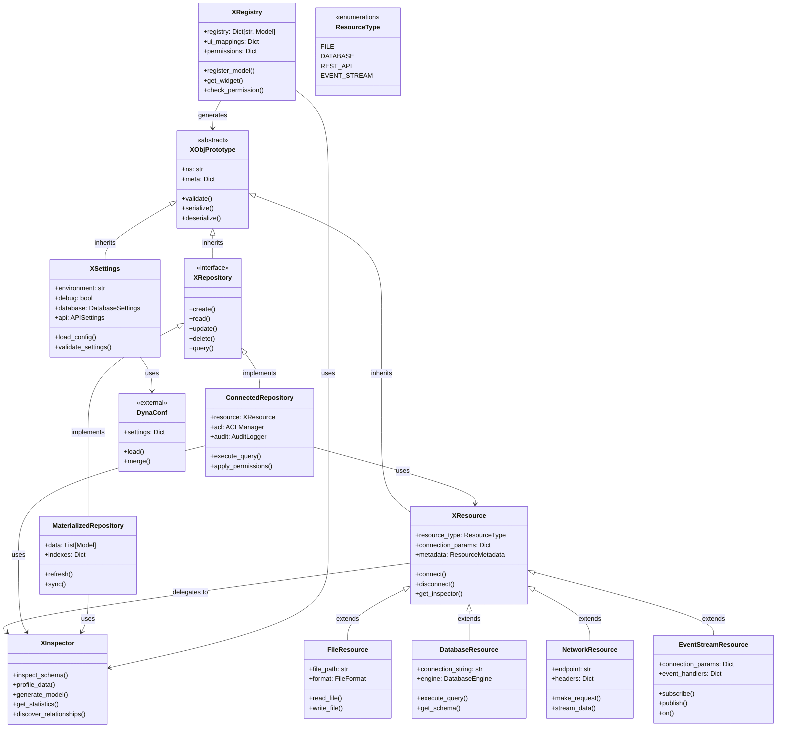
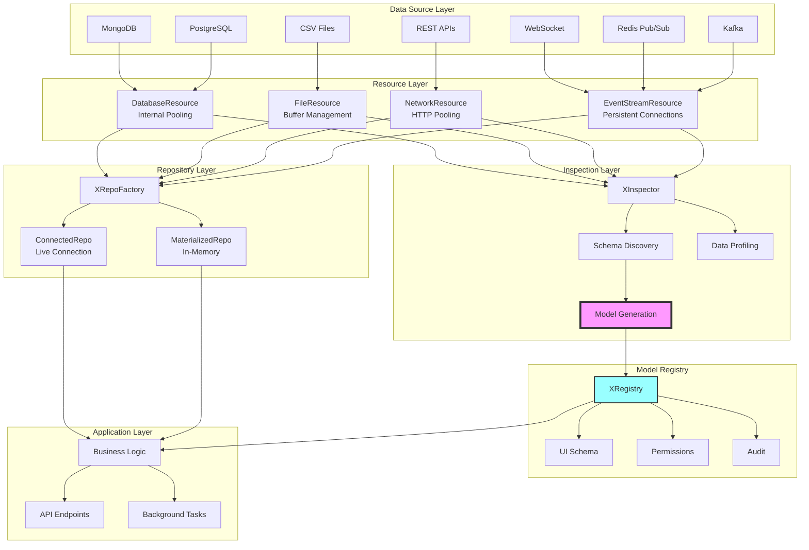
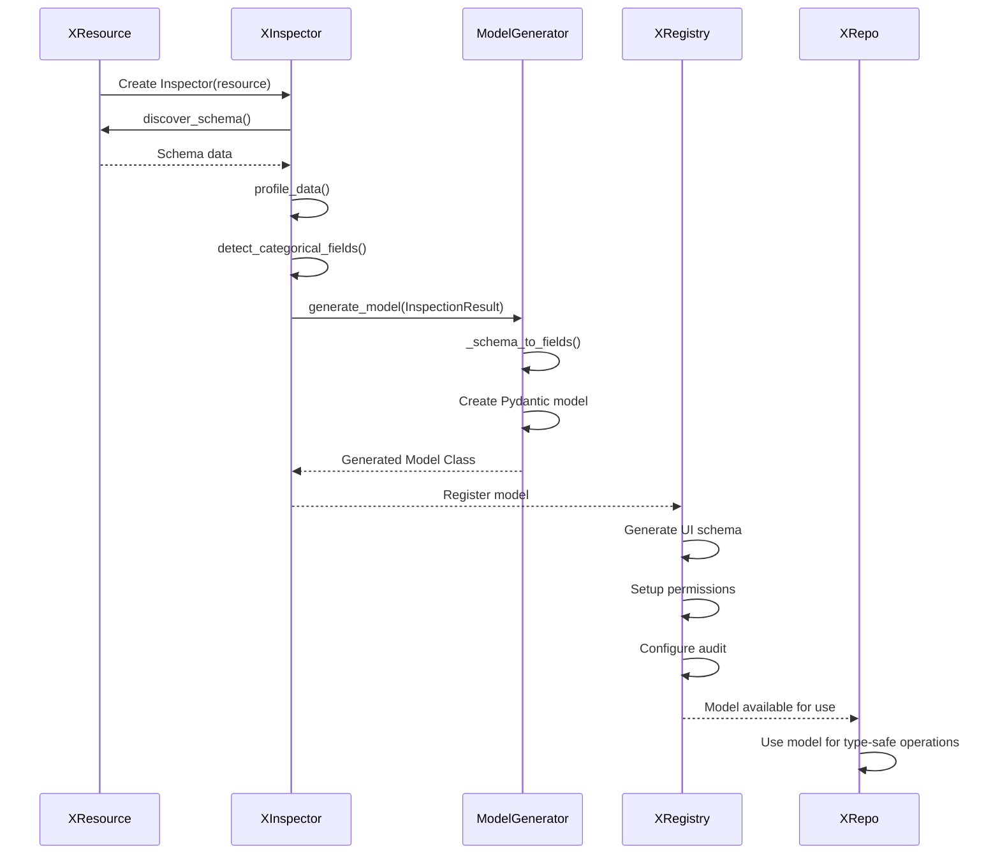
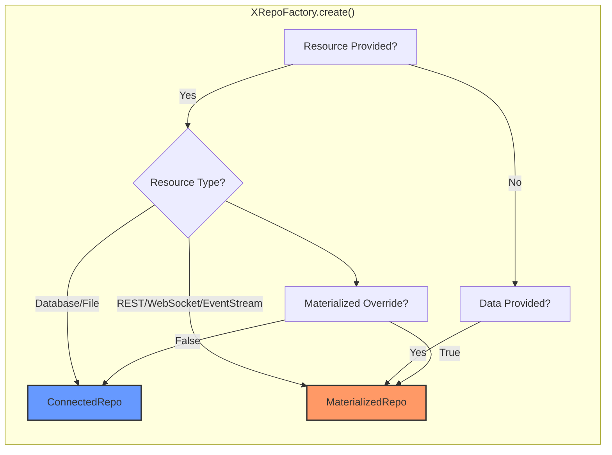
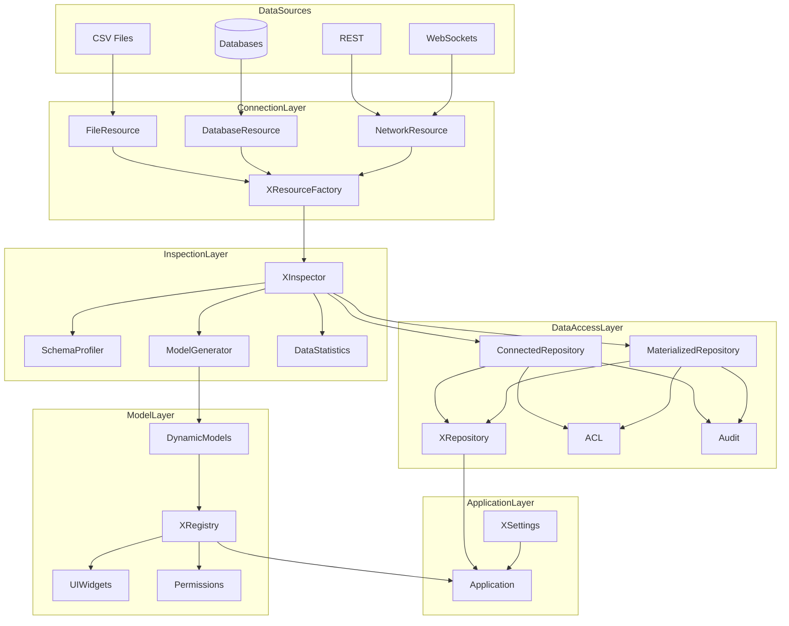
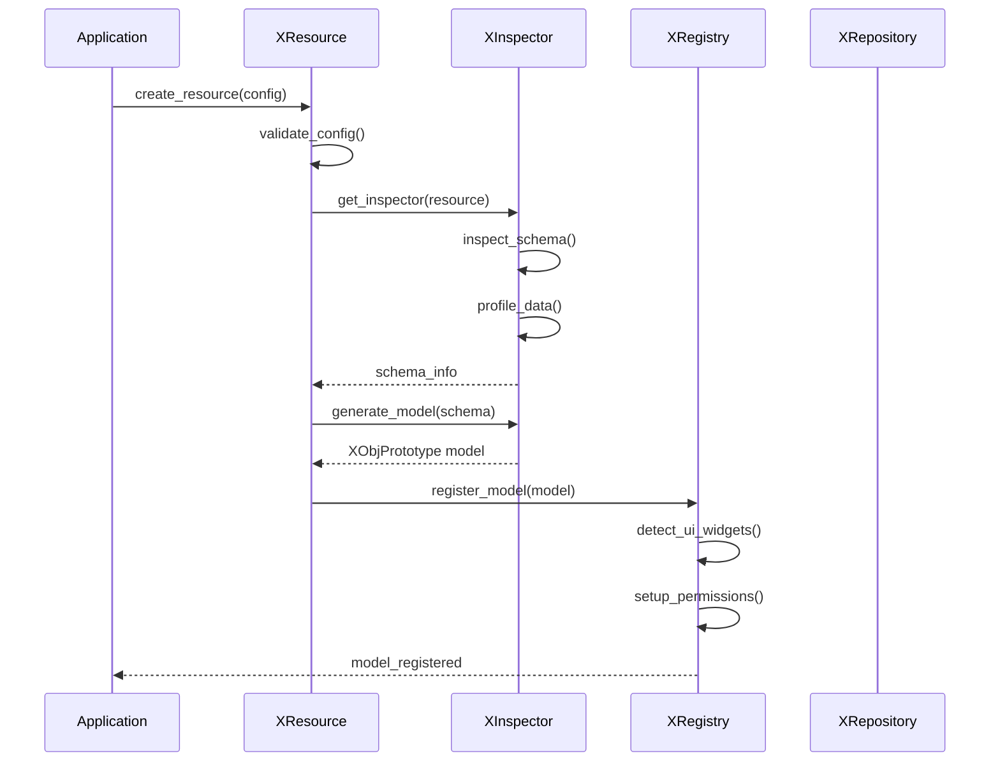
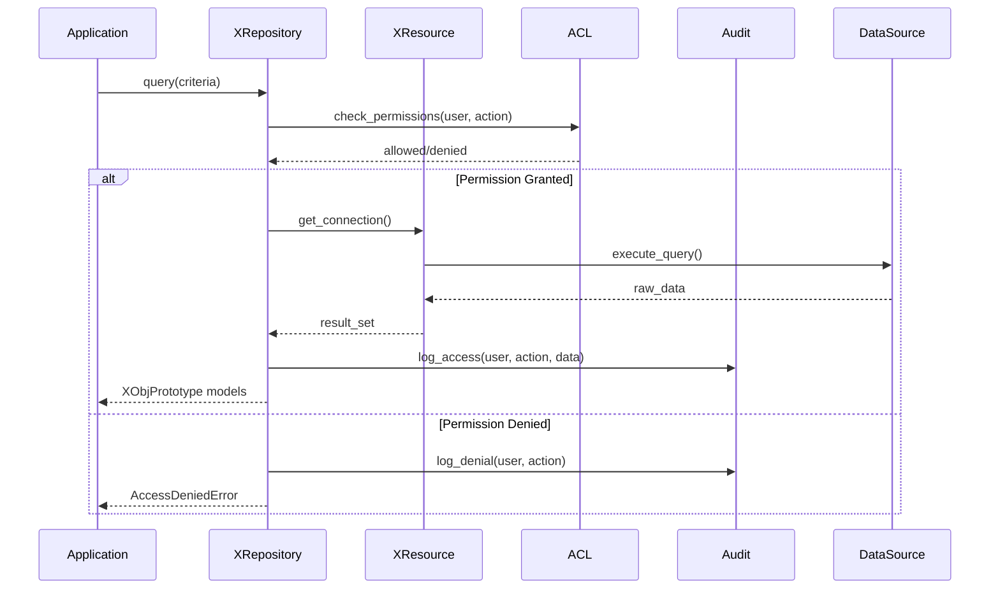

# System Architecture

## Architecture Overview

This document provides a comprehensive view of the system architecture, showing the relationships and interactions between all major components.

## Key Architectural Decisions

Based on the architecture review (see TODO.md):

1. **Strict ABC Pattern**: XObjPrototype uses runtime enforcement to prevent direct instantiation
2. **Clear Separation of Concerns**:
   - **XInspector**: Schema discovery and model generation (analysis phase)
   - **XRegistry**: Model registration and management (runtime phase)
   - **XResource**: Connection management with internal pooling
   - **XRepo**: Data access with smart factory defaults
3. **Model Generation Flow**: Inspector → generates models → Registry registers them
4. **Resource Pooling**: Each resource type manages its own connection pooling internally
5. **Flat Metadata**: Simple Dict[str, Any] for maximum flexibility

## Component Relationships

## Data Flow Diagram

## Model Generation Flow

## Resource Type Auto-Detection

## Sequence Diagrams

### Schema Discovery Flow

### Data Access Flow

## Component Responsibilities

### Core Components

| Component         | Primary Responsibility   | Key Features                                  |
| ----------------- | ------------------------ | --------------------------------------------- |
| **XObjPrototype** | Base model abstraction   | Validation, serialization, ns support         |
| **XSettings**     | Configuration management | Environment-aware, DynaConf integration       |
| **XResource**     | Connection factory       | Multi-source support, metadata management     |
| **XInspector**    | Schema discovery         | Profiling, model generation, statistics       |
| **XRepository**   | Data access patterns     | CRUD operations, ACL, audit logging           |
| **XRegistry**      | Model registry           | Dynamic registration, UI mapping, permissions |

### Design Patterns

1. **Abstract Factory**: XResource creates appropriate connection types
2. **Strategy**: Repository implementations for different access patterns
3. **Registry**: XRegistry maintains central model registry
4. **Delegation**: Components delegate specialized tasks to Inspector
5. **Template Method**: XObjPrototype defines model structure

## Integration Points

### Inspector Integration

- **XResource**: Delegates schema discovery
- **XRepository**: Uses for model generation
- **XRegistry**: Leverages for dynamic model creation

### XObjPrototype Inheritance

- All models inherit validation and ns support
- Ensures consistency across the system
- Provides common interface for all data objects

### Settings Integration

- Central configuration through XSettings
- Environment-specific overrides
- Validation at startup

## Future Considerations

Based on architectural analysis, the following improvements are recommended:

1. **Consolidate Inspection**: Move all schema discovery to XInspector
2. **Simplify Repository**: Reduce complexity in repository patterns
3. **Enhance Caching**: Add caching layer for improved performance
4. **Standardize Errors**: Implement consistent error handling across components
